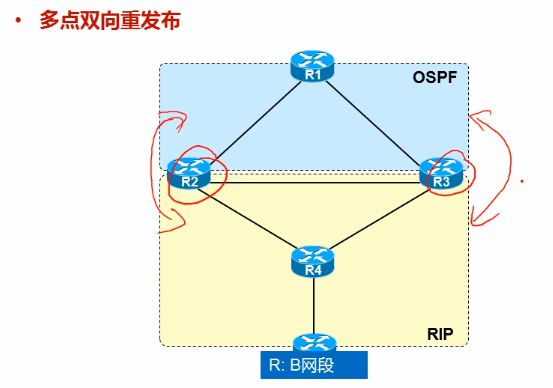

# 2021-02-15-ROUTE-REDISTRIBUTION

[红茶三杯CCNP_哔哩哔哩 (゜-゜)つロ 干杯~-bilibili](https://www.bilibili.com/video/BV12W411k7ee?p=19)

P19

---

一个网络各部分部署了不同的协议，同时，我们也希望全网是可达的

## 路由重发布的概念

 

---

### 路由回馈

 会有次优路径的情况发生

### 管理距离 AD值

### 细节

#### 度量值 - 默认种子度量值 不同动态协议路由选择时的默认值

所以我们常规配置时，需要去人为指定metric值，而避免因为默认的无穷大而影响路由选择。

向无类路由协议进行重分发的时候，需要加上subnets关键字。代表所有的子网都会重分发，否则只会重分发主类网络的路由

重发布的路由一定是本地路由表中存在的路由

做重发布是要考虑到方向的

 

---

有的时候，我们不希望去用network的方式宣告直连接口

因为这样的话该接口即运行了动态路由协议，且会不断的发送hello包，这是没有意义的。这种情况推荐采用重发布直连接口

且重发布直连的接口也会被以外部路由的身份对待

本地所有的直连接口

- 物理上up
- 协议上up （ppp需要协商成功[计算机网络基础4：点对点协议PPP_snmplink的博客-CSDN博客](https://blog.csdn.net/qingwufeiyang12346/article/details/79693492)）

当然，也可以重发布静态路由。

---

### 单点重分发

#### 单向重分发

#### 双向重分发

---

### 多点重发布

#### 多点单向重发布

---

