# 2021-02-16-ROUTINGPOLICY-PASSIVEINTERFACE

[红茶三杯CCNP_哔哩哔哩 (゜-゜)つロ 干杯~-bilibili](https://www.bilibili.com/video/BV12W411k7ee?p=20&spm_id_from=pageDriver)

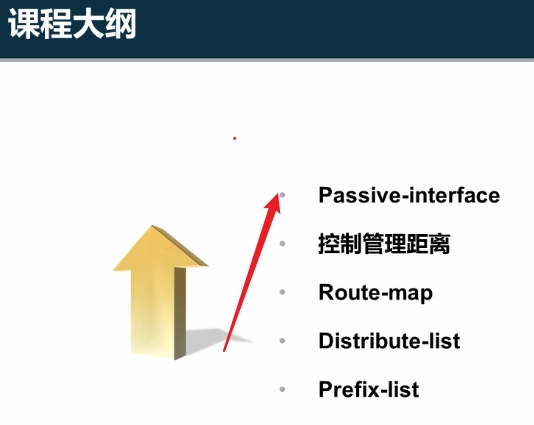

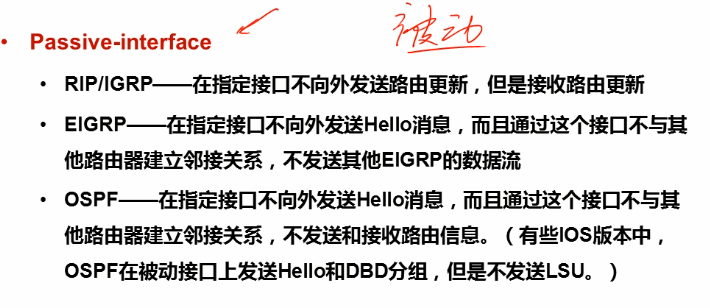

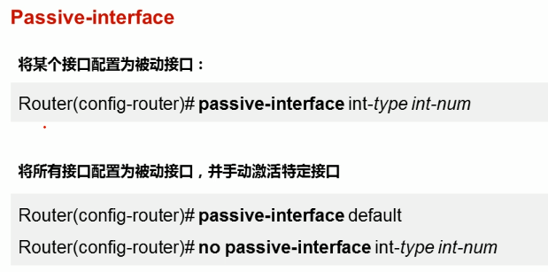

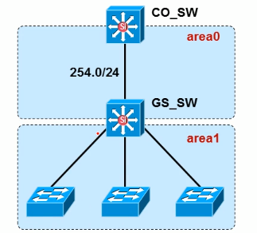

### 应用

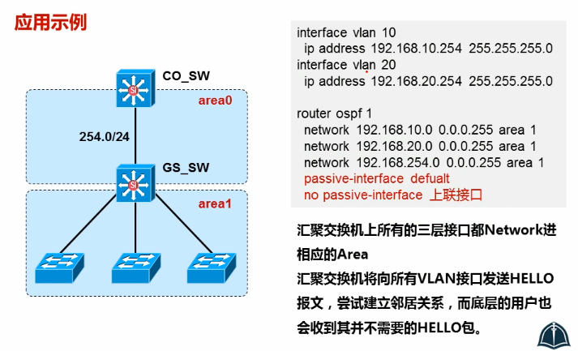

## passive interface 与 单播更新

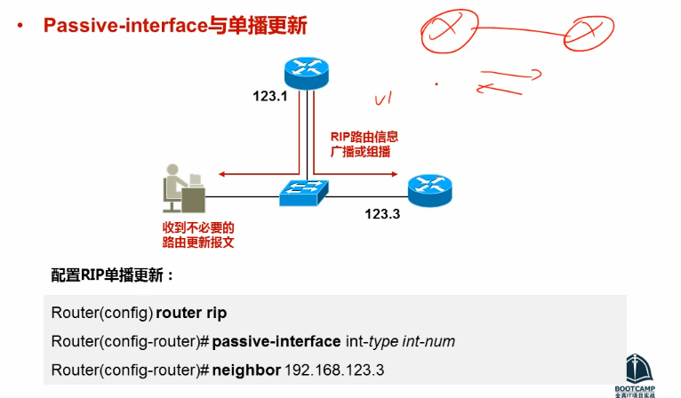

再用neighbor去手动指定邻居

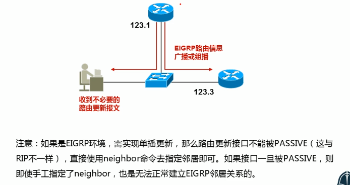

## 控制管理距离

选取某种方式，取决于需求的变化

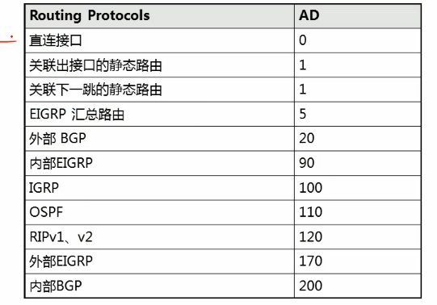

明细+ 汇总 可以实现一定程度上的数据分流

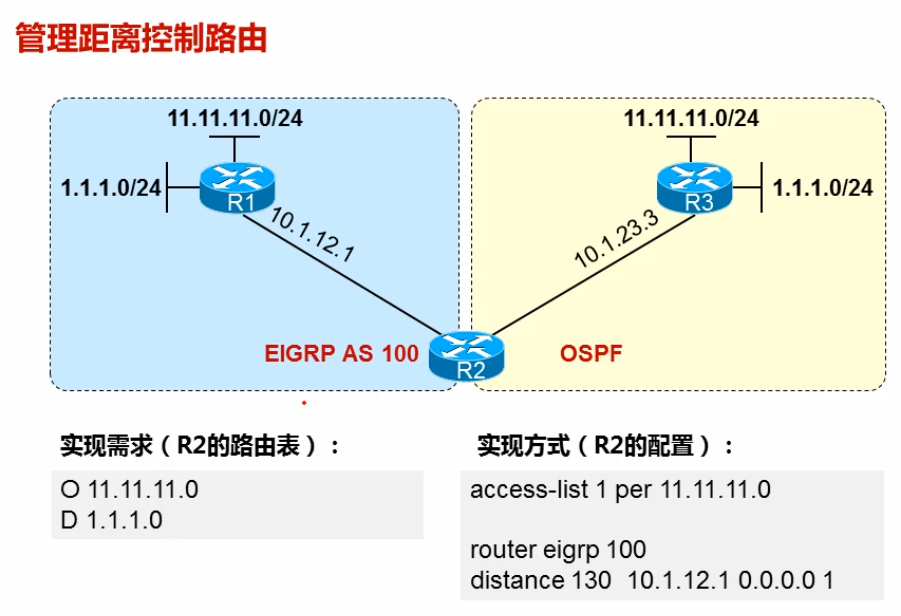

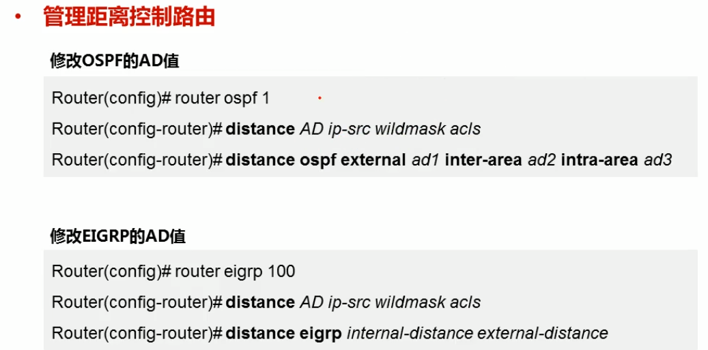

注意，这个调整只在本地有效

---

小AD值的协议重发布到大AD值协议的区域问题不大

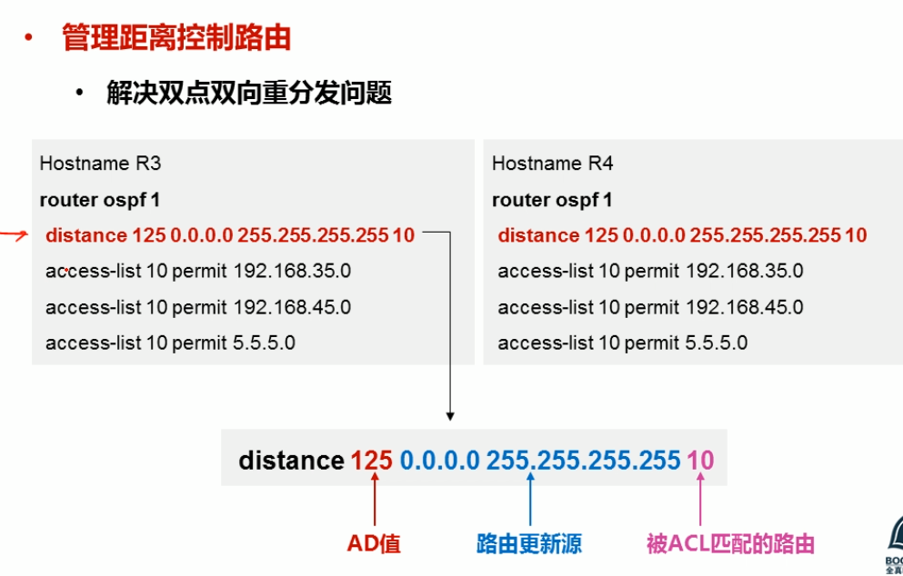