# p25 CNP

## BGP概述

网络结构区域划分更细致了

1. 可以减少ISA泛洪
2. 做一些路由汇总，提高网络处理能力
3.  ASR，ASBR的职能、增强对LSA的把控

重发布都是为了满足我们的路由需求。

as内部实现全网路径可达。

但是如果有多个AS，且AS之间需要路由互访，且路由条目很多的时候需要有BGP（一个公司的高层）

---

BGP申请AS号，是需要去申请的。（公网）

一方面和rip可能有点相似

当前主要是用V4

在IGP内网中，我们操控路由选择的工具不多，主要就是操控metric值来实现；

但是在BGP中metric是作为众多路径属性之一。

本身rip眼中，一跳是一个路由器

在BGP中，一跳是一个AS

传递的过程是一个倒叙排列

‘

 之前的IGP都是通过 **直连，组播**这些方式来发现邻居。ospf的报文包是封装在IP中，而RIP是基于UDP的。

在这里不同的便是BGP是基于TCP协议的。

BGP不会自己主动发现邻居。不会周期性的更新自己的路由表

BGP有五种报文消息。

### BGP peer

注意，对等体并不要求直连

#### EBGP

ebgp一般采用直连接口去实现，相邻的EBGP对等体之间发的包TTL是1，也印证了这一点。

## BGP属性

## BGP的基本配置

- p26

在尝试将BGP重发布进ospf当中时，一定要考虑做一些过滤。因为BGP的路由条目是很多的，这个过程中一定要做好把控

---

### BGP同步

对于第一条，除非又收到IGP获悉，才能传给EBGP，这样是为了防止路由黑洞；这也是同步规则最致力于解决的问题。

#### 解决路由黑洞

将BGP重发布进ospf。当然这个动作时很不建议去执行的，过程一定要谨慎。

在as内部跑一个BGP全互联，即可保证不会丢失某节点EBGP传来的数据包

即做到了无死角

> **查资料-水平分割**
>
> 水平分割 split horizon：水平分割是一种在两台路由器之间阻止逆向路由的技术。
>
> 逆向路由：reverse route：路由的指向与报文的流动方向相反的路由。这样做很重要的原因是**不会**把从路由学习到的可靠信息再返回给这台路由器。
>
> 

只有传递给EBGP邻居，aspath才会更新。（离开as的时候才会发生改变）

既然同as内aspath不变化，那么内部就会有产生环路的风险。

从某一个ibgp邻居获得路由，不能在内部传递给任何一个ibgp邻居

BGP表学到的内容，得到的就是BEST。

在as内部，IBGP的AD值会比较大，因为as通常会采用IGP来决定路由

## BGP基本配置

### 创建BGP进程

至少要有一个子命令才能激活协议

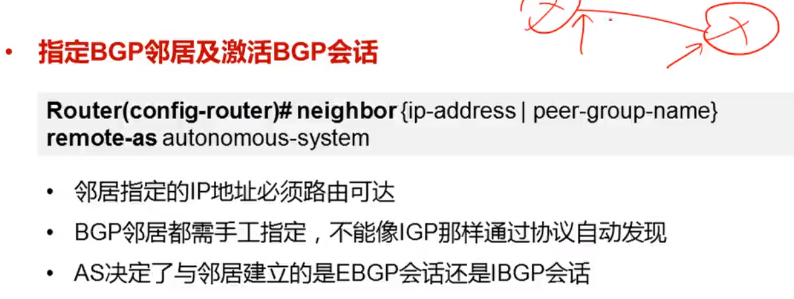

配置bgp时，需要用neighbor 去指明邻居，可以用ip也可以用回环接口，注意第三条，as决定了邻居建立的是EBGP还是IBGP

即使启动了BGP进程，但是若没有装载路由条目，则展示路由表便是空的

IGP协议 network后接的是本地的直连接口，会主动发hello包去发现并建立连接

而BGP协议中，network后接的是IGP路由表

这种写法，是无类的路由通告，前缀必须和路由表一模一样，

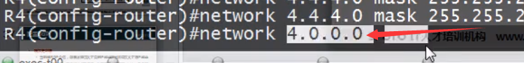

这个是有类的写法，且要配合 auto-summary，倘若启用了 no auto-summary 则这种network的宣告是无效的

\> 代表最右，且只有最右的这条路由才会被通告给邻居。

#### bgp同步

#### router-id

### 指定更新源

部署IBGP的时候，建议使用loopback接口为更新源，因为在as内部运行IGP的前提下， loopback接口总能互通，并传递必要的BGP信息

如图所示，在配置时，首先要指明邻居，其次是指明自己的更新接口，（而不是默认的直连接口出口

nexthop的变化是有条件的。但是A还不知道要走B，他只知道应该去C。可以在AB之间添加一条静态路由，但是这并不是最优的方式

设置多跳，multi-hop时的注意：

由于ebgp协议中，两个直连路由器发包的ttl为1，而之前部署的接口为loopback，至少实际需要两条，我们就需要多跳去实际设置一下

这是一条配置两个直连路由器之间的指令

注意

# BGP p27

### BGP身份验证

# BGP p28 路径属性

## weight 权重值

这是思科私有属性，其他设备上跑BGP可能不支持这个属性；本router有效，（是自己认为的重要的内容）

有两点需要注意

- weight不能进行传递
- 不能对其他BGP peer做out方向的设定

### local preference

在as内部发会作用，公认自觉。优先级的值是可以更改的。

### as path

除了是公认强制属性，也是防环的重要内容。

#### as-path的四种类型

所以，加上as—set这个常见于发生过路由汇总的场合的属性，即可让汇总的路由器产生的信息继承明细的aspath，且其顺序不重要，只要包含即可用于检测环路

### origin 公认强制属性

### MED 可选非传递属性，可以理解为一个度量值

设计的初衷，是在AS之间去影响流量。

且留意到，并不提倡利用MED在as内部来介入路径选择，因为这样并不符合其设计初衷

### NEXT_HOP

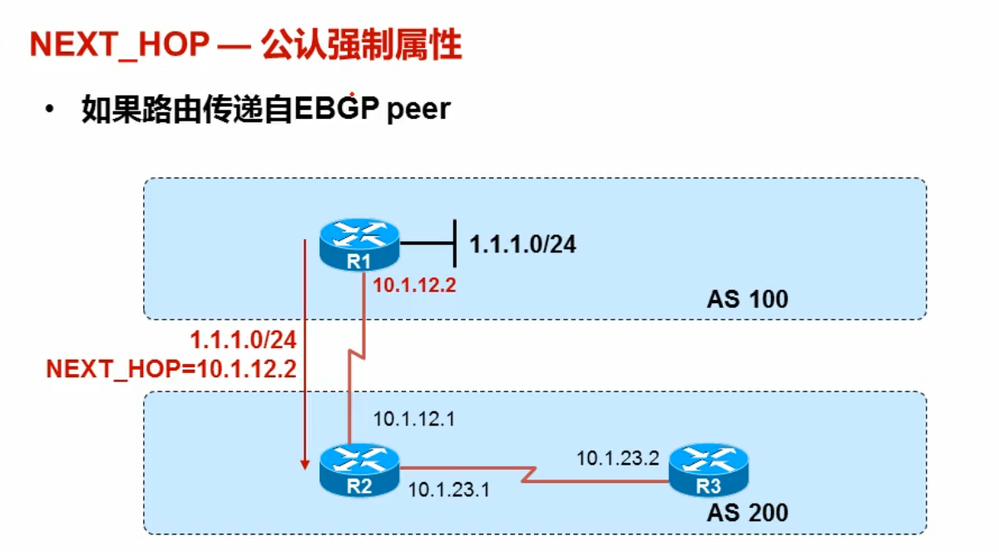

就是去往某一路由前缀的下一跳目的地

如果时将IGP引入BGP,那么将会继承在IGP中的下一跳

一些特殊情况。

> 这部分来说，和next-hop油管的案例，场景有很多，实践中不断去加强和检验吧。

### COMMUNITY

（团体字）

#### 几个必要的数值

> **BGP联邦**
>
> 
>
> 联邦的EBGP和正常的EBGP之间的关系还是有区别的

# p30 路由策略-路由汇总

很多协议实际上都有汇总的能力。

	

当然，不是继承所有的属性，仅仅是继承部分的属性。

summary-only是拒绝所有明细，但实际上加上某些关键字我们可以拒绝部分明细

这个attributemap可以调控汇总路由的特定属性

# p31 正则表达式 在BGP中的应用

> BGP设计与实现 这本书值得推荐

乘法字符必须搭配常规字符

可以通过正则表达式来过滤as-path以筛选满足条件的路由，配合prefix-list，accest-list即可。

# p32 通过community操纵路由

本身应用的场景决定了其部署的场景是很庞大的。

如果没有定义联邦，和no-export是一个意思。

在观察之前要基的清理一下bgp的表，且这个过程中用前缀列表去匹配会有更好的效果

 

这个动作相当于acl里的去匹配ip

这一条community-list 11，匹配了那些携带community值为100：11的路由

留意到，要添加community值，指令某位要添加一个additive，否则将是覆盖。且community值不仅仅是数字，还有很多关键字同样都属于community值

### community-list （很多方面很类似acl

去进行newformat的时候的指令为：

在configure terminal中调用ip bgp-community newformat

他能将整数处理为形如100：11的模样，且要保持一直，才能在community-list中去匹配。

列表的匹配也是讲道理的，分成两行和一行，是 或 与 与的关系

无论在哪定义了route-map，最后一定要落实到具体的接口上，需要应用了它，实际才能产生效果

当想要删除某个community值的时候，用到community-list去进行permit那个想要删除的值

# p33 BGP路由策略

整体的BGP filters，过滤能力是很强大的

## prefix-list

update source不要利索当然的去设定，要不然很可能出错

## distribute-list

在IGP中反复进行过滤使用，且字段后接实际用acl定义的列表

这是第二种方式

注意到，实际上distribute-list后面可以连接的内容是很丰富的

这个案例实际上就是测试分发列表对于重发布的路由是否能同样起到过滤的效果

## Route-map

各种协议，各种场合都可能会遇到route-map

### match

### set

匹配感兴趣册策略，集中在路径属性的把控上

注意network场景下的影响范围，它涉及到路由器周边的所有设备，都会受到宣告的影响，如果只想针对某个路由器针对性处理，则可以选用neighbor进行选择

### policy-list，一个小的特性

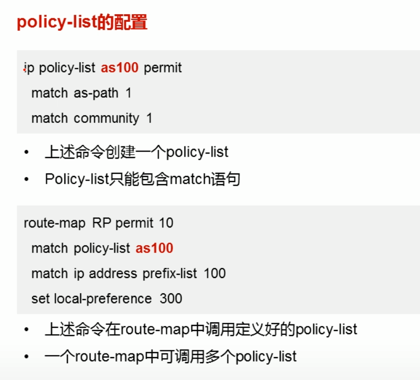

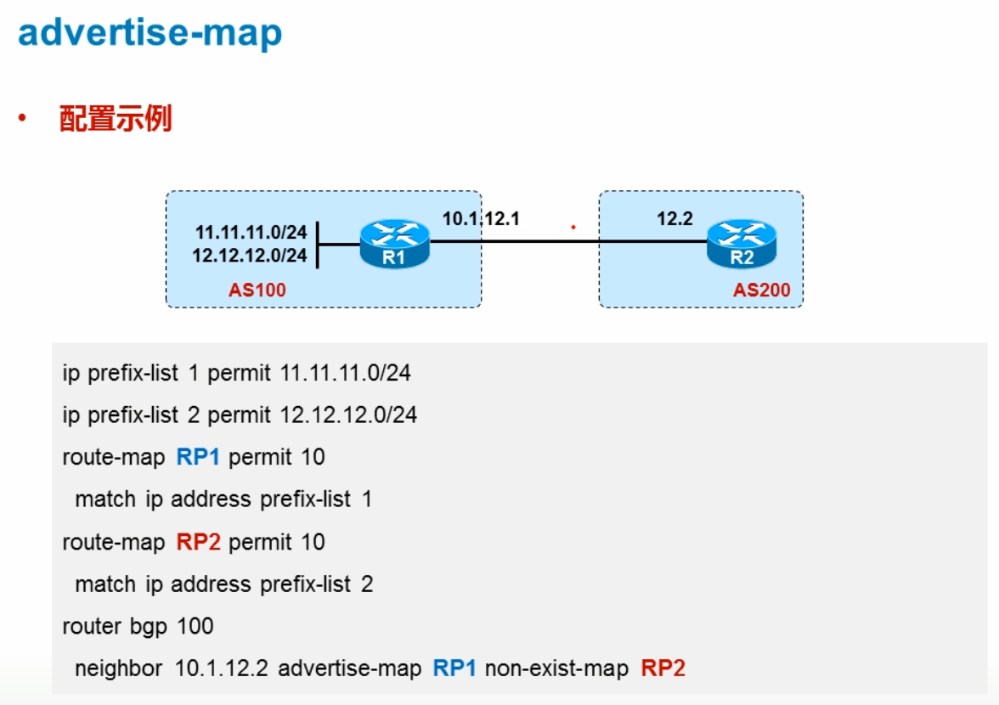

上述语句的含义为当RP2匹配的路由还存在时， 仅更新12.12.12.0.当这条路由挂掉的时候，模式转换为更新RP1所匹配的内容

### ORF特性

两台路由器如果要建立ORF关系，则之前的BGP关系就需要重建，因为某种程度来说ORF就是BGP的一种扩展能力。

orf的sender可以是路由的接收者，这一点身份转换需要注意，理解其含义即可认识到

这种很多的配置，我还是想，在实践中去尝试吧。

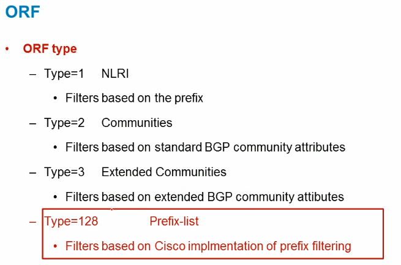

# BGP deaggregation 路由拆分

做路由拆分的前提是，首先自己这台路由器上部署过路由汇总

我们从汇总路由中便可以拆分出明细，而拆分出的明细是什么就有自己来决定了

> 背景
>
> 

## 配置

注意两个route-map的编写是要符合规范的

> 案例
>
> 
>
> 这个是在路由器中放汇总路由的指令，as-set说明汇总路由将继承路径属性
>
> 
>
> 这个时候发现，汇总路由是优化过的，之前的明细路由就被抑制了

注意，汇总的就是要两个match，一个更新源，一个汇总的前缀列表

明细，都是set

# p34 路由反射器，联邦

解决同一个问题的两个不同的方案

回顾这个水平分割规则，即一个路由器从ibgp邻居收到的路由不会再发送给其他的ibgp邻居

注意动作上的描述，**发送**，**反射**

## 示例 1

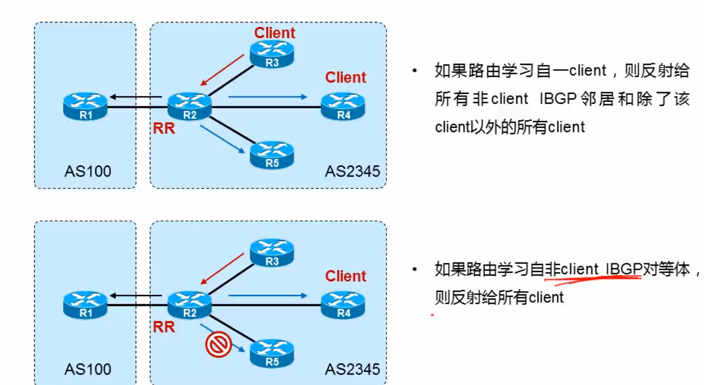

配置是在RR路由器上进行的，所以其自身明白哪些路由器是客户，哪些不是

两个重要的RR防环路径属性

第一个是起源，第二个是蔟，是一个簇ID（列表），

这样，由于两台RR的ID一致，就不会发生重复的传递工作了

下面即为路由反射器的配置

例如下面标红的即为1.1.1.1为自己的客户

为了实现全互联，避免受水平分割规则的限制

# p35联邦

confederation

联邦内部，可以进一步划分**成员as**。设定联邦的好处，注意BGP邻居关系，不是不同的IBGP和EBGP了

注意此时路由传递的路径属性就会发生一些变化了。

## 联邦内的BGP路由属性

且实际上，不管怎么划分，单独的as内部如果有多路由器，为了实现互通还是会先采用ospf协议来进行，且用各自的loopback接口来操作

BGP知识点：[BGP知识点解析-Steven.Q的学习笔记-51CTO博客](https://blog.51cto.com/steven24/111159)

注意

即使是联邦AS内部的EBGP关系，nexthop属性仍然不发生变化

### LP属性

### as-path

联邦的扩展性不高，且队设备要求过多。不一定适用于大多数的场景

# p36 BGP选路规则详解

路径属性很丰富，对需求的匹配能力很强，且适用于大规模网络

## 1. 优选具有最大weight值的路由

作用在本地，值越大越优先

值也是可以进行修改的

用route-map去操控也是首选方案

## local preference

和weight的配置方式是类似的

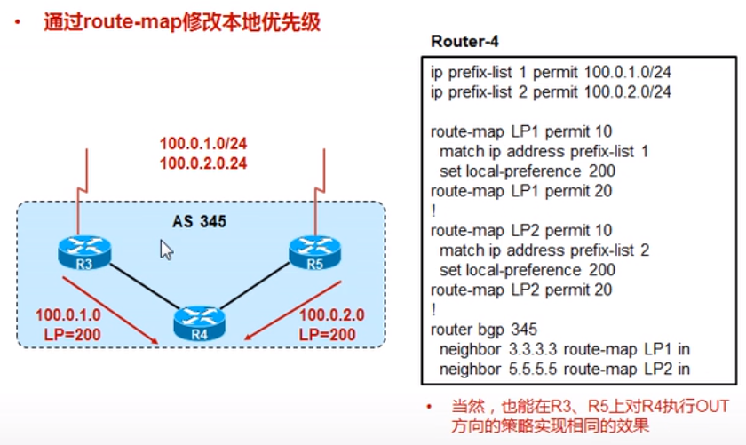

## 优选起源于本地的路由

## 优选AS-path最短的路由

注意prepend字段，

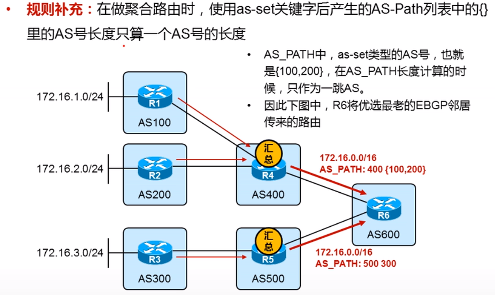

## 比较origin code （igp  > egp > incomplete)

修改注入方式，则可以且换路由的起源。

当然也可以采用route-map的形式来进行处理。

## 优选MED最小的路由

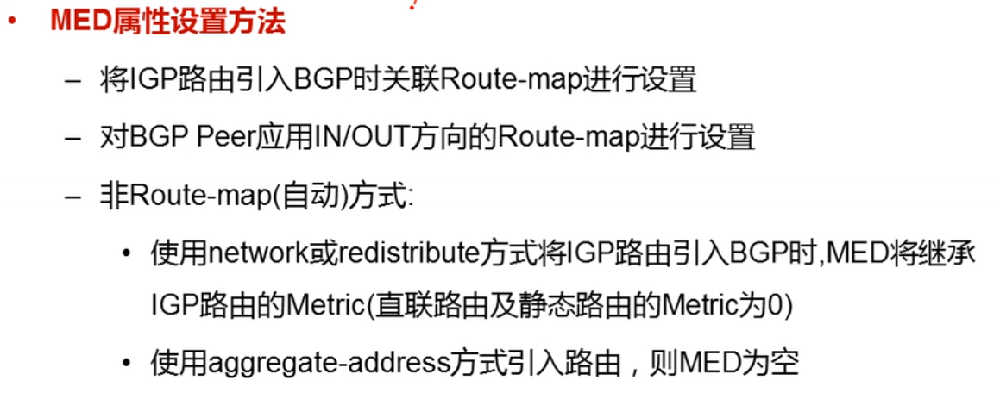

network某一个路由的时候，直接关联route-map就可以

## 优选EBGP邻居的路由

## 优选到NEXTHOP最近的路由

注意路由反射器，对路由进行反射的时候，并不会修改next-hop的数值大小

会读字段

## 负载均衡

配置一个多路径选项

路由表中会出现，两个下一跳

## 优选最老的EBGP邻居来传递路由，降低翻滚的影响

但是在IBGP环境中并不适用

！ 如果不希望看交情来选路由则按照下述方法即可

## 优选router-id最小的BGP邻居的路由

两个RR属性，originator 起源，cluster list

## 优选cluster-list最短的路由 可以实践一下

## 优选邻居ip地址最小的路由

# p38 BGP非等价负载均衡 Cost Community

这个时候，只考虑了接口是1比1分配，却未考虑带宽大小，这显然是不合理的

第三行的指令即为bgp link bandwidth（这是一个扩展的community属性）

负载均衡也有很多种形式，比如说，基于数据包的和基于目的地址的

限制：

# P39 cost community

cost这个值，也是一个重要的扩展

community值，在send的时候，区别是很大的；

扩展的值，一定要后接extended

> 且cost community包含两个部分，1是cost id 2是 cost value

## 两个插入点

## limitation

## 如何影响最佳的路径选择

不能上来就先比value，一定要按照id的先后来比较

# p40 移除私有协议的影响

## 移除私有AS

## Dual AS

这给了我们一种环境迁移的手段

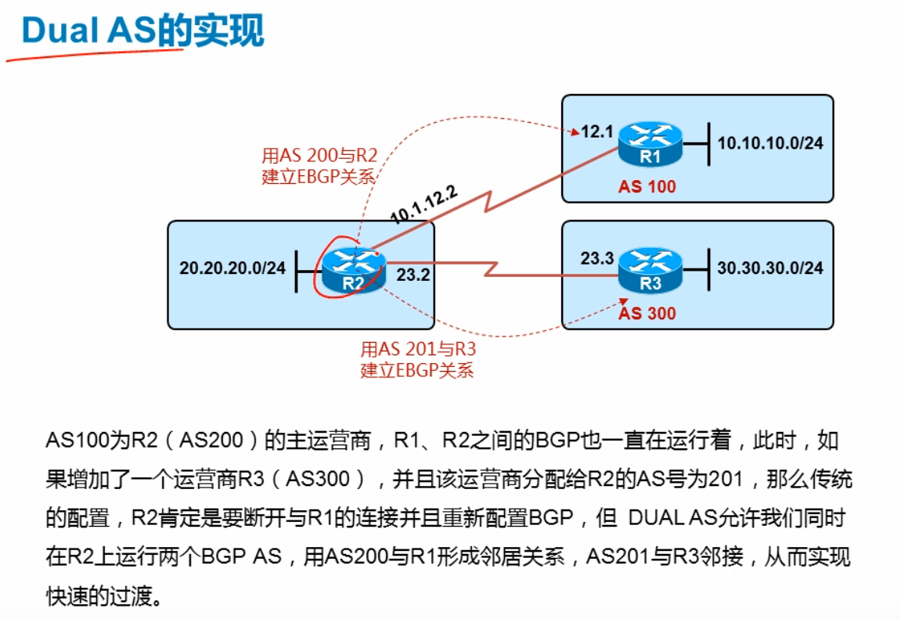

开启特性，指明second as号

## BGP policy accounting

### 配置步骤

