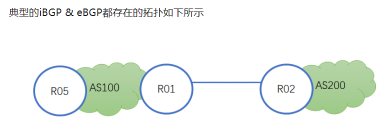

# ccietea-bgp-learn-notes

## 1 基本概念

必须 BGP进程中使用neighbor指明对等体

BGP无法像IGP那样自动发现邻居，需要手工指定，因此邻居的IP需要本地的BGP来指明

为了保证建立IBGP连接的稳定，一般采用loopback接口进行连接

经过试验验证表明：R1和R2到对方的loopback扣的网段用静态路由或动态路由相互学习的时候,BGP邻居关系建立都没问题，如果两端都用默认路由互指，则BGP邻居关系无法建立，这是为了防环的目的。但是如果一边用静态，一边用默认就可以。

### 1.8 IBGP水平分割

注意，BGP防环是通过AS_PATH实现的，而AS_Path仅仅在路由离开AS区域才会被更。所以，在AS内部的时候，IBGP没有EBGP的防环能力，所以为了防止环路的出现，BGP路由器不会将从IBGP邻居学习过来的路由再通告给自己其他的IBGP邻居。

**BGP规定，不将通过一个IBGP获悉的路由传播给其他所有IBGP邻居，这个是BGP的水平分割规则**

所以由于水平分割原则的存在，BGP要求AS内，必须保证IBGP全互联（指的是neighbor命令指定），-》根本原因是在AS内部，AS-PATH不会改变，无法使用AS_PATH防环，因此很容易出现环路

### 1.9 IBGP与IGP同步

在一个AS内部运行OSPF，其最直接的作用是路由可达

注意：**路由黑洞**，有的设备因为没有运行部分协议，导致并不了解有的数据包需要发送到哪里

为了避免这个问题，可以考虑在已经运行BGP协议上的设备上将BGP重发布进OSPF来解决。但是后果是不可估计的，因为BGP承载的路由条目规模是未知的。

另一个解决方法：要求AS内路由器都运行IBGP并且实现IBGP全互联，那么路由器内部的路由器就都能知晓BGP路由，这样可以解决路由黑洞的问题。

【同步的概念】BGP路由器从IBGP邻居学到一条路由后，是不启用（不计算在内的），除非它再次从IGP学习到相同的路由才会启用，最直接的目的就是防止发生路由黑洞的问题。

而如果某个网络已经实现了IBGP全互联，那么同步就没有意义了，此时就可以关闭同步规则。

> 路由反射器 router reflector
>
> RR提供了在大型IBGP实现中IBGP全网段连接问题的一个简单解决方案。为保证IBGP对等体之间的连通性，需要在IBGP对等体之间建立全连接关系。假设在一个AS内部有n台路由器，那么应该建立的IBGP连接数就为n(n-1)/2。当IBGP对等体数目很多时，对网络资源和CPU资源的消耗都很大。
>
> 利用路由反射器可以解决这一个问题。在一个AS内，其中一台路由器作为路由反射器（RR）其他路由器作为客户机（Client），与路由反射器之间建立IBGP连接。而路由反射器在客户机之间传递（反射）路由信息，客户机之间并不需要建立BGP连接。
>
> 更通俗的来说，出现多余的或是重复的路由条目。在学习的时候一般是在路由重分发时两边路由协议的AD值不同，导致路由条目重复。由此引起的路有环路和路由不精确。

## 2 Advance

- [next-hop-self]: https://zhuanlan.zhihu.com/p/20303060

  > 
  >
  > 当R01将R02收到的路由发给R05的时候，不会修改NEXT_HOP属性，这就导致对于R05来说，R02的地址是不可达的，递归路由失败下面有两个解决方法
  >
  > - 将R01和R02的直连路由通过BGP或者IGP宣告给R05
  > - 在R01上设置对R05的next-hop-self，效果是当R01将路由通告给R05的时候，会修改下一跳为自身，由于R01的IP地址在AS100内通过IGP可达，就消除了下一跳递归失败的问题
  >
  > **结论**：
  >
  > next-hop-self > IGP发布外部直连 > BGP发布外部直连。
  >
  > 从管理边界角度考虑，如果外部直连并非由本地AS分配，那么一定选择next-hop-self，原则上不应该让不在自己管理范围内的互联网进入内部网络，污染内部路由。

### 2.2 联邦

​		联邦的相关特性：

​		- 

