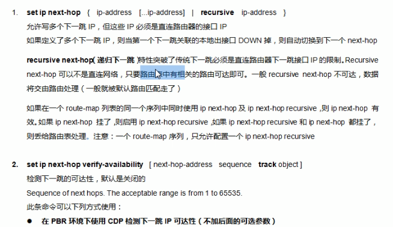

# offset-list - PBR

## 路径控制

> 这本身是一个庞大的课题

都是为了提升网络的弹性，高可用性

### 路径控制工具

修改一个条数，

out后的2，是在原本的hop基础上增加2，而不是变成2

一部分金融，保险行业还能看到rip的身影，网点设备之间可能会部署，因为其比较简单

也需要规定出入方向。同时也要指明这个路由器的具体接口是什么

# PBR策略路由

要把策略路由和路由策略区分清楚

这是对传统路由的性能上的提升

传统的时候，只看传统的目的ip地址，除此之外不再看其他的参数；

### 策略路由policy-based routing

你想x走左，y走右的话。即可使用策略路由。（基于route-map）

根据路由来进行分流

### PBR应用示例

注意做一定的区分，在route-map中，我们是去抓路由；

在这里用acl抓的是DATA，

其中“set ip”即强制性的将匹配过的数据的目的ip进行修改，以达到预期的要求

注意“ip policy route-map test”这句部署指令，是在数据的in（入）接口进行使用	

且，从上图可以得知，PBR的优先级是远高于路由表的，即使路由表中已产生了目标路由，也仍然先会遵循路由策略的选择

在这里 match acl匹配的是数据

next hop后面可以并列写多个ip地址，当前面的接口down了，且直连网段消逝，则会跳转到下一个。这便提供了一个备份的机制。

应用：

注意，本地始发流量，不能用第一条应用指令，（如ping）

由于CDP是思科的私有协议，这个场景只能在纯思科环境下运行。它能检测到对端宕机；

CDP协议通常是禁止掉。

### 场景3 PBR

还是基于思科的一个特性，帮助我们发现网络的性能。可以帮助我们衡量网络的健康状况

> 首行lsa 的 responder是可选项
>
> 只需要探测可达性，第三行采用了echo + icmp来探测对端可达性， 也是基于传统的路由表
>
> 尾行，我们将其绑定到了一个对象上，可以方便我们去追踪状况

也是思科的私有特性，即设备需要支持lsa

### 场景4 PBR的配置

recursive关键字，可以不是本地直连，但是路由表中一定要有

> 上述最后一行，指了一条默认路由，以归类那些路由表中没有明确指明的路线，数据包该往哪里发送

## 案例

注意，PBR的转发是不会更改数据包的原始信息的

加default的影响是很大的，而default加上之后，PBR的优先级会低于路由表 

### 案例4

由于加入了NAT

第一步，实现数据的分流（常规的PBR）

再实现NAT（更换一个数据的源头）

现在就需要四个route-map来帮助功能的实现

### 综合实验

1： 在r2上做路由协议的重发布，因为以后其他部分的设备可能也需要通过协议传递路由

[红茶三杯CCNP_哔哩哔哩 (゜-゜)つロ 干杯~-bilibili](https://www.bilibili.com/video/BV12W411k7ee?t=2459&p=24)

这一集讲了部分路由汇总会造成的陷阱

重发布设置metric的值很有讲究，有路由策略和数据控制的作用

rip ： 即使是别人传递给我的，在边界也同样会做路由汇总

在rip里可以利用关联ACL的方式把一些路由的AD值调小

