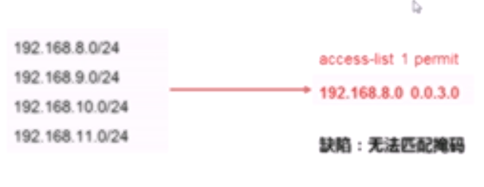
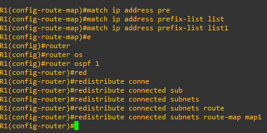

# prefix-list

- 用来匹配路由的

需要用特定的工具去匹配特定的路由条目

目前最常用的工具即ACL

采用反掩码，可以过滤很多新的内容

计算反掩码

这个时候，我们就需要采用扩展ACL的策略来进行处理

四组 32位数据，左边两个对应着ip地址，右边两个对应着对掩码的约数

但是这种扩展ACL实际上也不太方便去部署，计算上需要花费不少功夫。

所以采用前缀列表去处理这种情况

## 正文： 前缀列表

### 配置

22位是完全一样的。

ip prefix-list test permit 192.168.4.0/22

同时再限制掩码的长度，

