# synet

一个运用datalog的运用于计算机网络领域的配置和成策略

由ETHZ开源

-----

核心思想：

利用分层的datalog，可以把实际网络中的路由行为，协议配置要求等的行为进行记录描述，同时把这一个整体的datalog进行划分为分层datalog，以迭代的方式处理子问题。

再抽象一下论文的工作。根据实际网络的相应需求。可以通过模型导出相应的输入配置

----

## 应对的挑战

- diversity：不同的协议有不同的表现形式，他们转发信息计算的依据是不同的。

- dependency：协议之间会彼此依赖，或在某种程度上有一定的影响。
- feasibility：搜索空间会很大，即若要满足提供的配置项需要去组合的一个输入配置文件的开销是很大的。

## 主要贡献

- 一个网络合成问题的形式化规范——分层datalog的（配置）输入合成
- 第一次针对分层datalog提出的输入合成**算法**。也可应用于网络之外的领域。
- 在带有特定网络优化的情况下，我们算法的一个实例化例子，即针对一个网络的输入合成问题
- 运用我们的算法在几个网络中实践并验证

## 用到的技术或需要的知识

- SMT
- datalog
- logic programming
- BGP、OSPF and static route

----

### 复习一下谓词逻辑

 命题的符号化结果都是谓词公式

个体词分个体常项(用a,b,c,…表示)和个体变项(用x,y,z,…表示)；谓词分谓词常项(表示具体性质和关系)和谓词变项(表示抽象的或泛指的谓词)，用F,G,P,…表示.

注意，单独的个体词和谓词不能构成命题，将个体词和谓词分开不是命题.

量词，是在命题中表示数量的词，量词有两类：全称量词（∀），表示“所有的”或“每一个”；存在量词（∃），表示“存在某个”或“至少有一个”.

在谓词逻辑中，使用量词应注意以下几点：

(1) 在不同个体域中，[命题符号化](https://baike.baidu.com/item/命题符号化)的形式可能不同，命题的真值也可能会改变.

(2) 在考虑命题符号化时，如果对个体域未作说明，一律使用全总个体域.

(3) 多个量词出现时，不能随意颠倒它们的顺序，否则可能会改变命题的含义.

[谓词公式](https://baike.baidu.com/item/谓词公式)只是一个符号串，没有什么意义，但我们给这个符号串一个解释，使它具有真值，就变成一个命题. 所谓解释就是使公式中的每一个变项都有个体域中的元素相对应.

----

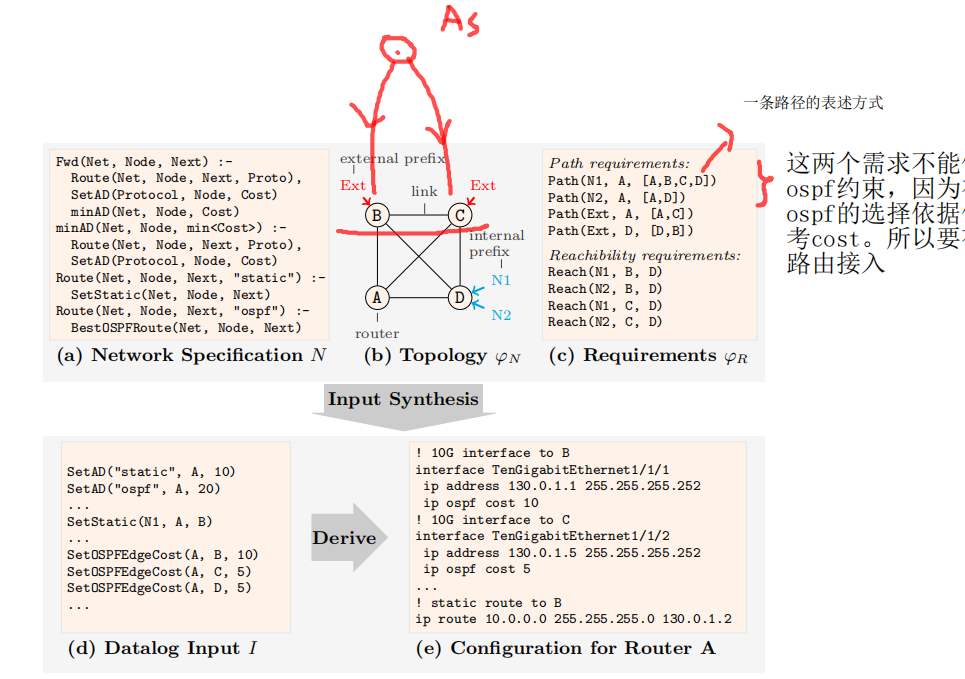

这是一个通篇的抽象。是再从更抽象的逻辑层面之后，简化后的一重编码；

后文也看出，这种建立端口的连接，节点的声明等。都可以用离散数学中的谓词来抽象，或者说表示。

----

## 合成器的工作流程

### 输入

1. Declarative network specfication N, 一种描述性质的网络规范，用在本文中提到的stratified datalog，即分层数据记录来做表示
2. 网络拓扑结构 的 约束 constraint N，且是利用N的输入**谓词**的形式来表示
3. 需求 constraint R， 以N的输出谓词的约束来表示。

合成器的作用即针对网络的规则（specification）指定一个N，可以构造一个输入配置项I，且能保证其符合正确的网络配置。

### 输出

仍然是得到一个datalog 形式的input，然后我可以根据设备的需求（不同路由器可能有些差异）得到一个适用的配置项

## 几个技术细节

### 分层数据记录 stratifed datalog

- 句法
  - rules

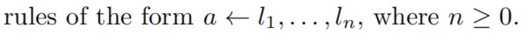

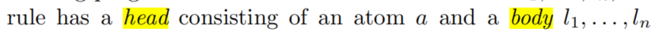

a的位置叫头部，而body中的每个l可以含有一个literals的列表。

原子a是一个**谓词符号**，与一个含有**变量**与**值**的列表同时出现. 值可以代表自然数，字符串。 同时在模型中我们限定了：值的集合是有界限的。可以用符号来替代。

Preds 这个集合中包含了各种谓词符号，即包括常见的<, <= 还有=. 而且谓词可以直接通过Datalog rules 进行定义

- literals

terms

- 语义

-----

15nsdi的 datalog

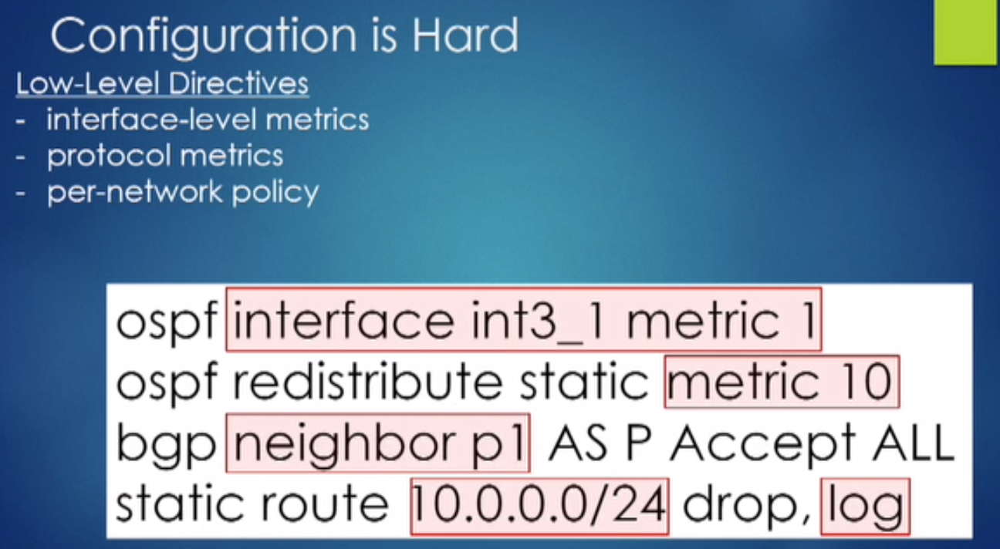

想用high level的去限制，但是协议有很多。 且协议间有交互性

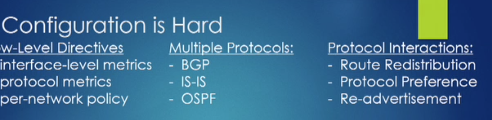 

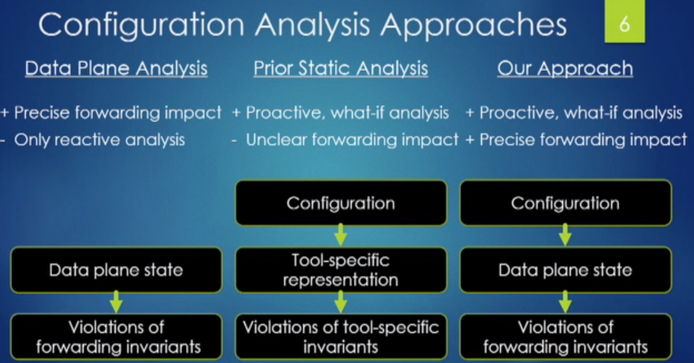

两种经典思路的结合体，解决了各自的弊端。

将配置项与data plane state做了一个link

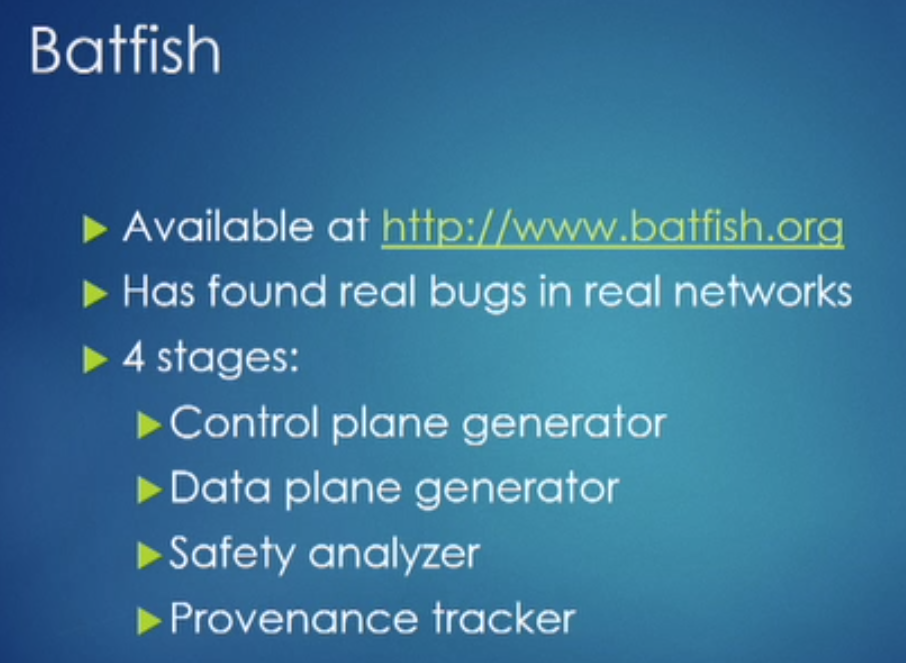

这个应该是他们开发的demo

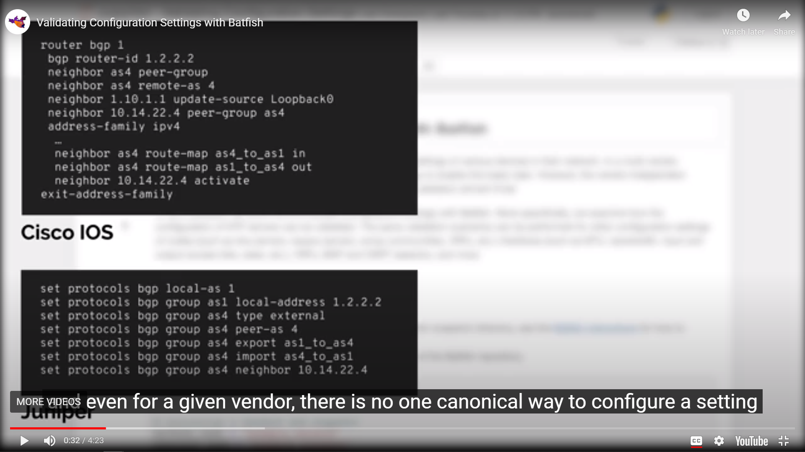

确实，不同的厂商设备在路由器配置的指令上存在差异

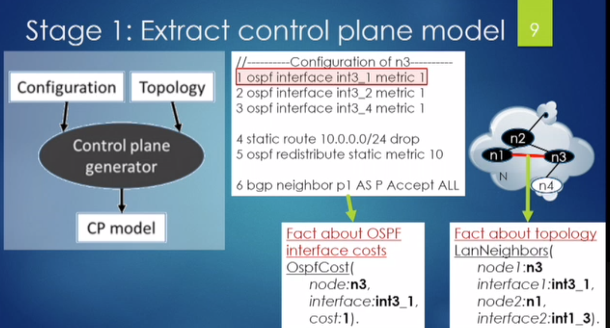

概括来说，提供了很多relationship 的操作。

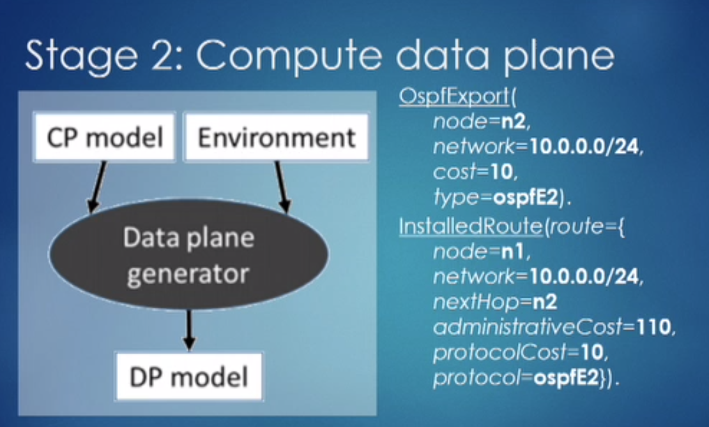

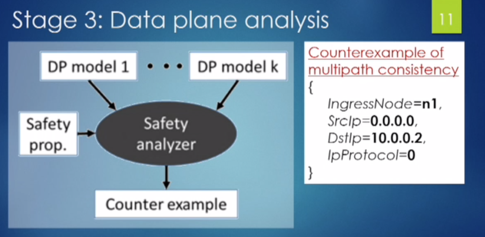

 multipath consistency

注入反例

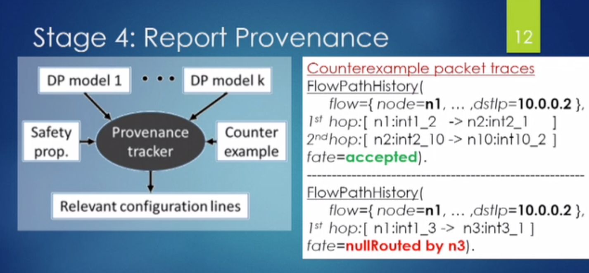

以具体的flow（数据包）测试，查看当前的配置是否可行

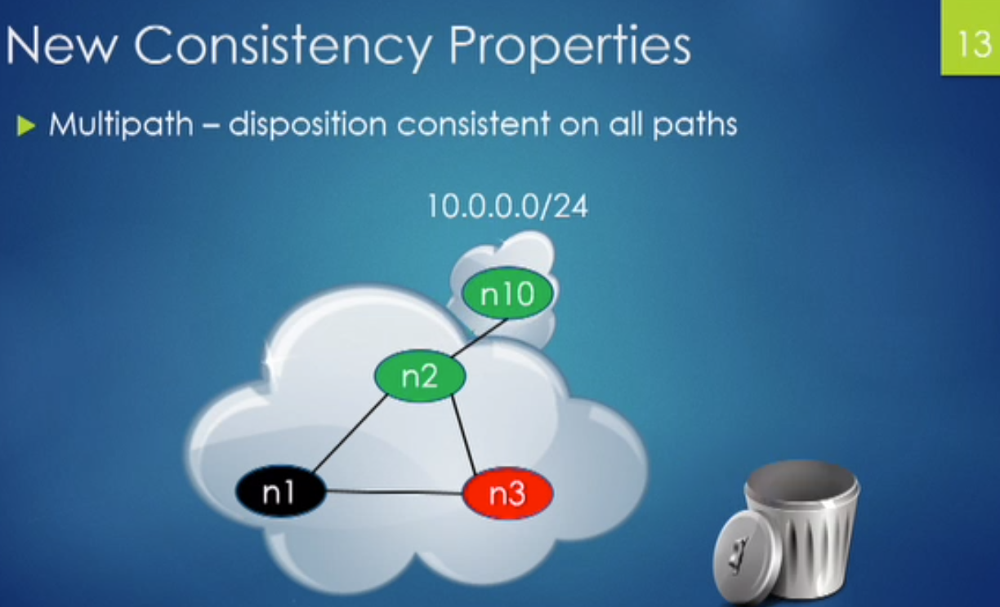 	

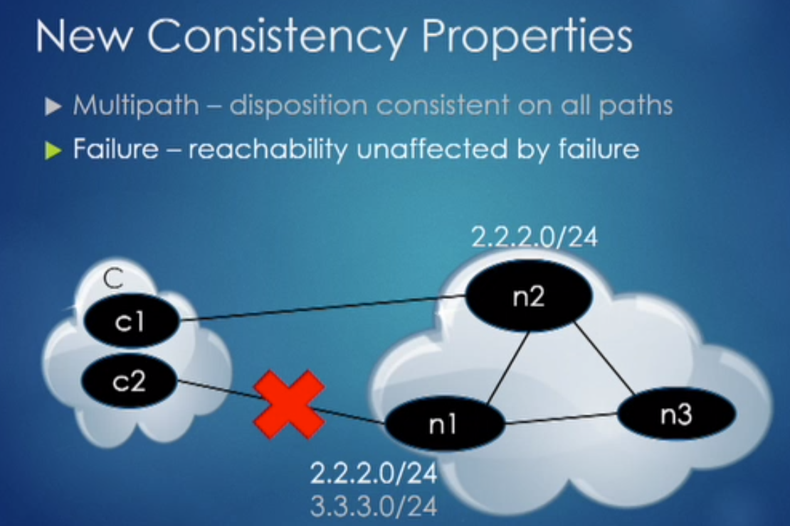

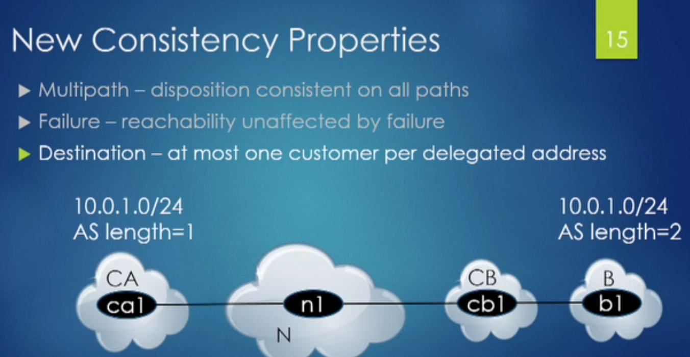

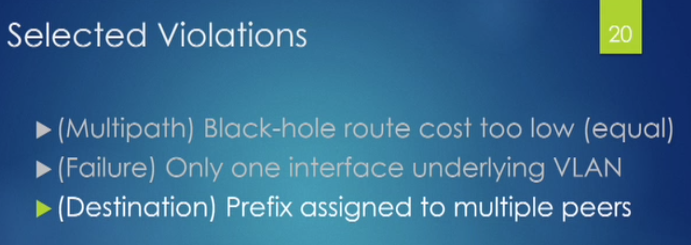

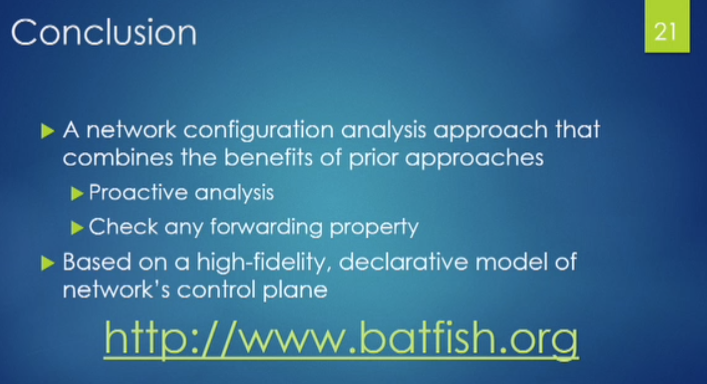

很多网络中的内容都可以model ，可能最难的东西是正则表达式。

