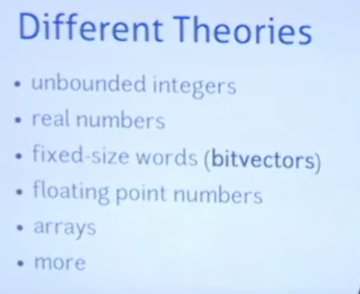
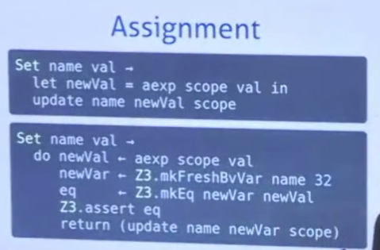

# 2021-02-16-ANALYZINGPROGRAMSWITH-Z3

[(60) Analyzing Programs with Z3 - YouTube](https://www.youtube.com/watch?v=ruNFcH-KibY)

什么是SMT solver

 

解决一个经典的np难问题

你设定一组参数，solver可以给你一组可行的解，或者告诉你无法成立

---

而SMT是在SAT上的扩展

我们进而可以对数组，或者其他更丰富的事物上进行约束

让我们的编码更简单了

拥有更多的 domain-specific insights

---

z3's capabilities

---

分析程序的时候，每个参数代表什么，尤为关键

因为参数的搜索路径范围太广了，不同的路径搜索可能会陷入无限循环

我们可以固定输入，来solve for outputs，我们也可以fix outputs 去 得到一个reverse interpreter

中间我们也可去加入很多的约束条件，以获取我们感兴趣的中间值

---

越复杂的语言，越难去写一个formula compiler

single static assignment

每一个变量都用新的名字。

interpreter中 arithmetic等formula只能求值，无法进行修改

whole constraints 是 partial partial 得到的

这只是个简单的例子，困难一些的情况还需要去界定参数的范围

在z3 solver中 scope中包含了很多符号变量

上图可以看出为了应对跟复杂的情形，+ 法中也引入了recursive的行为

z3 solver 某种程度上简化了assertions的操作 （pieces by pieces）

incremental solving

它允许我们在求解过程中引入新的变量，同时利用到之前步骤得到的状态下的结果，以至于不会让我们redo一遍

然后，在scope中，我们update scope

z3 保证赋值操作的时候，变量都是fresh的

  

所以，它可以作为我们的interpreter，虽然运行速度没有保证，但是可以让我们检测我们的formula，我们的变量赋值是否有意义

可以用来reverse检测我们的输入。

也可以chekcinvariants。bounded model checking

一个SMT的经典适用场景

我们take一对输入输出，然后我们输入程序，我们送入verify 然后得到一个counterexample 。然后我么们把他送入synthesizer，然后再让verifier检验

理论上，我们每次找到一个反例，我们就找到了该算法中的一种边界情况，所以我们便可以对搜索空间进行快速的剪枝 (通过输入输出pairs）

程序员知道编码的结构，例如哪里需要loop，哪里要放条件，哪里要声明变量。

这样我们写代码的时候就可以预留bunch of holes，

 

----

