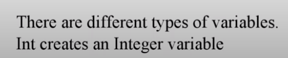

# 2021-02-16-INTRODUCTIONTOPYTHONZ3

[(62) Introduction to Python Z3 - YouTube](https://www.youtube.com/watch?v=FVK3eA8B5hA)

在运行规则之前，变量需要定义

---

---

先去判断该问题是否为命题逻辑可满足问题，才能进入我们的计算过程中

model函数用来进行求值

如果我们要获取模型中具体的某个变量的数值，我们需要借助变量将其保存下来

规则的移除是需要条件的：

只有在add操作前，先规范的使用push，然后才能在后面用pop的方式将规则删除

