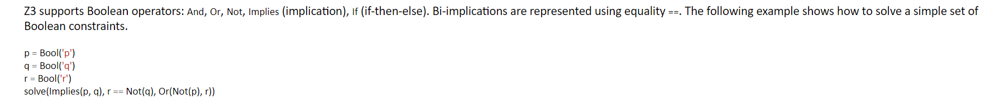
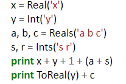
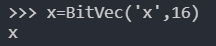

# 2021-02-19-Z3GUIDE-MS

https://rise4fun.com/z3/tutorialcontent/guide

z3功能强大，可以用来检测不同领域下逻辑公式的可满足性问题。

不同于其他工具是专门为某个领域设计生产的，z3 提供了一种跟灵活的方式，为软件分析与验证服务。


这篇tutorial重在教一些使用范例，侧重点不在一阶逻辑的原理

---


check state是保证程序能得到结果的关键一步


一个关于声明函数的帖子

https://stackoverflow.com/questions/11883185/z3py-declaring-function

```python
from z3 import *

x=Int('x')
c=Int('c')
t=Int('t')

s=Solver()

f = Function('f', IntSort(), IntSort())

# x*t+c = result
# x, result = [(1,55), (12,34), (13,300)]

s.add (f(x)==(x*t+c))
s.add (f(1)==55, f(12)==34, f(13)==300)

t=s.check()
if t==sat:
    print s.model()
else:
   print t
```

上面这个案例是想求解参数t和x，但实际上应该对z3的规则定义有误解，帖子下面跟了解答

```python
from z3 import *

c=Int('c')
t=Int('t')

def f(x):
    return x*t + c

# data is a list of pairs (x, r)
def find(data):
    s=Solver()
    s.add([ f(x) == r for (x, r) in data ])
    t = s.check()
    if s.check() == sat:
        print s.model()
    else:
        print t

find([(1, 55)])
find([(1, 55), (12, 34)])
find([(1, 55), (12, 34), (13, 300)])
```

这个人的理解就很直接，并不意味着非要用z3的语句来定义函数，就用python来定义函数。然后中间不断矗立着数据，也是可以的

有一句话挺关键的：'Z3 supports universal quantifiers(用于断言所陈述的普遍命题对所描述的宇宙或类的所有成员都是正确的形式表达). However, they are very expensive, and Z3 is not complete when a set of constraints contains universal quantifiers since the problem becomes undecidable. '

所以说，这个人就是因为引入全局量词可能的成本太高，所以避免了这样的引入，但实际上应该是定义的问题。他没有讲俺很想知道的这个事情。


---

实际上z3的函数定义就是形如：

f = Function('f', IntSort(), IntSort()) # 目前个人对这个的理解是，定义一个返回值类型为Int的函数f，参数包含一个，是Int类型的

类似与这样，同样是前缀表达式，话不多说，先试试

---

## API的使用，肯定是基础


可以更多的把sort理解为type的含义


注意，这是个参数列表


但是我还是没能理解多参数复杂函数的定义模式


---


## z3py的tutorial

https://ericpony.github.io/z3py-tutorial/guide-examples.htm

虽然是python2，但是最好直接上手，于是先跟这个学

这是最简单的一个例子的展现


写的不规范（加空格）也不要紧，又simplify这个函数可以帮忙


同样，顾名思义，也可以起到化简的作用

为traversing expression提供函数，即遍历，（有很多工具不提供遍历的方式吗？


注意赋值方式 将整个表达式“x+y >=3"赋值给了n


一个表达式，每一部分都是一个组成环节，可以调用这个库去查看名字


real可以表达各种数学状态，整数类型，有理数类型，非有理数的代数也可以。带有整数系数的多项式根可以是一个非有理数

当然也有布尔形式的





这里面碰到了一个Implies函数，可能是说其参数只有一个为真


多项式与布尔表达式是可以相互结合的

---

### Solver（）


Solvers 这是z3举足轻重的一个部分，

>Z3 provides different solvers. The command `solve`, used in the previous examples, is implemented using the Z3 solver API. The implementation can be found in the file `z3.py` in the Z3 distribution. The following example demonstrates the basic Solver API.

在很多场景下，可能会有相似的问题拥有共同的约束条件，这个时候我们可以利用push 和 pop操作来对各子独特的条件进行再判断。

> The command `push` creates a new scope by saving the current stack size The command `pop` removes any assertion performed between it and the matching `push`. The `check` method always operates on the content of solver assertion stack.

再solver中添加的条件assertions也是可以进行遍历查看处理的：


> The command `check` returns `sat` when Z3 finds a solution for the set of asserted constraints. We say Z3 **satisfied** the set of constraints. We say the solution is a **model** for the set of asserted constraints. A model is an **interpretation** that makes each asserted constraint **true**. The following example shows the basic methods for inspecting models.

调用solver的model函数即得到一个约束条件全为真的一个实例


注意，打印的东西和其key分别是什么，不是传统的字典那种样子，不过看一下就能明白

不过这种方式去遍历貌似更加正统


变量的声明也有很多中形式：


---

### Arithmetic

z3 支持 real和整数型变量，也允许将他们混合再一个问题中，再有必要的时候整数型会被自动转化为real




常规的数学运算都是被z3支持的

而且simplify函数还能改变这种多项式的形式


运算的中间结果也可以被表示出来，包括那些复数

The internal representation can be extracted using the method `sexpr()`. It displays Z3 internal representation for mathematical formulas and expressions in [s-expression](http://en.wikipedia.org/wiki/S-expression) (Lisp-like) notation.


当然，这如果是有需要的话


理解起来，可以说是一个前缀表达式了

### Machine Arithmetic

> Modern CPUs and main-stream programming languages use arithmetic over fixed-size bit-vectors. Machine arithmetic is available in Z3Py as *Bit-Vectors*. They implement the precise semantics of unsigned and of signed [two-complements arithmetic](http://en.wikipedia.org/wiki/Two's_complement).
>
> The following example demonstrates how to create bit-vector variables and constants. The function `BitVec('x', 16)` creates a bit-vector variable in Z3 named `x` with `16` bits. For convenience, integer constants can be used to create bit-vector expressions in Z3Py. The function `BitVecVal(10, 32)` creates a bit-vector of size `32` containing the value `10`.

现代计算机通常用定长的向量来进行计算，这个例子介绍了如何使用比特向量进行工作。

整数常量可以被用来创建比特向量表达式，BitVec含有两个参数，第二个参数总是代表长度。




```
# -1 is equal to 65535 for 16-bit integers 
print simplify(x + y - 1)
```

当然， 也可以定义比特向量形式的常量


在32位的情况下，-1和65535是不相等的

> In contrast to programming languages, such as C, C++, C#, Java, there is no distinction between signed and unsigned bit-vectors as numbers. Instead, Z3 provides special signed versions of arithmetical operations where it makes a difference whether the bit-vector is treated as signed or unsigned. In Z3Py, the operators `<`, `<=`, `>`, `>=`, `/`, `%` and `>>` correspond to the signed versions. The corresponding unsigned operators are `ULT`, `ULE`, `UGT`, `UGE`, `UDiv`, `URem` and `LShR`.
>
> 

因为我目前在学习的并不着重与数学运算。所以这部分我先掠过了

---

### Functions

> Unlike programming languages, where functions have side-effects, can throw exceptions, or never return, functions in Z3 have no side-effects and are **total**. That is, they are defined on all input values. This includes functions, such as division. Z3 is based on [first-order logic](http://en.wikipedia.org/wiki/First-order_logic).

这个意思是说，函数会有全局的影响

z3的函数，是unterpreted的，拥有最高的灵活程度. 没有附加先验解释

> they allow any interpretation that is consistent with the constraints over the function or constant.

> To illustrate uninterpreted functions and constants let us the uninterpreted integer constants (aka  variables) `x`, `y`. Finally let `f` be an uninterpreted function that takes one argument of type (aka sort) integer and results in an integer value. The example illustrates how one can force an interpretation where `f` applied twice to `x` results in `x` again, but `f` applied once to `x` is different from `x`. (这段我觉得说的云里雾里的)


可以妙用solver中的evaluate函数


注意，这个输出的值，应该就是model求值时满足这种条件的时候每一个assertion的状态。

---


### Satisfiability and validity

> A formula/constraint `F` is **valid** if `F` always evaluates to true for any assignment of appropriate values to its uninterpreted symbols. A formula/constraint `F` is **satisfiable** if there is some assignment of appropriate values to its uninterpreted symbols under which `F` evaluates to true. **Validity is about finding a proof of a statement;** satisfiability is about finding a solution to a set of constraints. Consider a formula `F` containing `a` and `b`. We can ask whether `F` is valid, that is whether it is always true for any combination of values for `a` and `b`. **If `F` is always true, then `Not(F)` is always false, and then `Not(F)` will not have any satisfying assignment (i.e., solution)**; that is, `Not(F)` is unsatisfiable. That is, `F` is valid precisely when `Not(F)` is not satisfiable (is unsatisfiable). Alternately, `F` is satisfiable if and only if `Not(F)` is not valid (is invalid). The following example proves the deMorgan's law.
>
> The following example redefines the Z3Py function `prove` that receives a formula as a parameter. This function creates a solver, adds/asserts the negation of the formula, and check if the negation is unsatisfiable. The implementation of this function is a simpler version of the Z3Py command `prove`.

```python
from z3 import *

p,q = Bools('p q')
demorgan = And(p,q) == Not(Or(Not(p), Not(q)))
print(simplify(demorgan))

def prove(f):
    s = Solver()
    s.add(Not(f)) # 加入一种假设，即f不成立，去查f是否invalid在任何输入下均成立
    # print(s.check())
    if(s.check() == unsat):
        print("proved")
    else:
        print("failed to prove")

print("proving demorgan..")
prove(demorgan)    
```


正如上文中提到的，这里用了类似一种反证法，如果F恒为真，则Not（F)将恒为假，即Not（F）没有任意一组可使其为真的解决方案（solution），所以Not（F）即为unsat，unsatisfiable的状态。

---

### List Comprehensions

> Python supports [list comprehensions](http://docs.python.org/tutorial/datastructures.html#list-comprehensions). List comprehensions provide a concise way to create lists. They can be used to create Z3 expressions and problems in Z3Py. The following example demonstrates how to use Python list comprehensions in Z3Py.

或许可以理解为怎么在这里使用python list。

```python
from z3 import *

print([x+1 for x in range(5)])

#create two lists containing 5 integer variables

X = [ Int('x%s' %i)for i in range(5)]
Y = [Int('y%s' %i) for i in range(5)]

print(X)

# Create a list containing X[i] + Y[i]
X_plus_Y = [ X[i] + Y[i] for i in range(5)]
print(X_plus_Y)

# Create a list containing X[i] > Y[i]
X_gt_Y = [ X[i] > Y[i] for i in range(5)]
print(X_gt_Y)
```


可以理解为创建了各种满足你约束条件的一个列表

~~~python
# Create a 3x3 "matrix" of integer variables
X = [ [Int('x_%s_%s' % (i+1,j+1)) for j in range(3)]
        for i in range(3)]
print(X[1])
~~~


i和j的顺序到无关紧要，这个就是常规的问题

```python
from z3 import *

d,a,t,v_i,v_f = Reals('d a t v__i, v__f')

equations = [
    d == v_i * t + (a*t**2)/2,
    v_f == v_i + a*t,
]

print("Kinematic equations:")
print(equations)

# Given v_i,v_f and a, find d

problem = [
    v_i == 30,
    v_f ==0,
    a == -8
]

print("Problem:")
print(problem)

print("Solutions:")
solve(equations + problem)
```


注意，最后solve中用的使equations + problem。尝试了一下逗号，编译器直接错误。

这里面的+应该使抽象的+，是把这些条件的参数组合在一起输入进去，或者说是一种赋值

---

### Bit Tricks

貌似是说妙用bit位的运算

> Some low level [hacks](http://graphics.stanford.edu/~seander/bithacks.html) are very popular with C programmers. We use some of these hacks in the Z3 implementation.

### Power of two

This hack is frequently used in C programs (Z3 included) to test whether a machine integer is a power of two. We can use Z3 to prove it really works. The claim is that `x != 0 && !(x & (x - 1))` is true if and only if `x` is a power of two.

```python
x      = BitVec('x', 32)
powers = [ 2**i for i in range(32) ]
fast   = And(x != 0, x & (x - 1) == 0)
slow   = Or([ x == p for p in powers ])
print fast
prove(fast == slow)

print "trying to prove buggy version..."
fast   = x & (x - 1) == 0
prove(fast == slow)
```


由上图可见，prove是一个z3的内置函数，可显示proved或者不成立时把反例展示出来。

### Opposite signs

The following simple hack can be used to test whether two machine integers have opposite signs.

```python
from z3 import *

x = BitVec('x',32)
y = BitVec('y',32)

# Claim: (x^y < 0 iffx and y have opposite signs)

trick = (x^y) < 0

# Naive way to check if x and y have opposite signs
opposite = Or(And(x<0,y>=0),
And(x>=0,y<0))

prove(trick == opposite) # z3可以让我们去检测一些情况是否拥有相同的判断结果

```


---

### Puzzles

一些有趣的基础使用场景

### Dog, Cat and Mouse

Consider the following puzzle. Spend exactly 100 dollars and buy exactly 100 animals. Dogs cost 15 dollars, cats cost 1 dollar, and mice cost 25 cents each. You have to buy at least one of each. How many of each should you buy?

```python
# Create 3 integer variables
dog, cat, mouse = Ints('dog cat mouse')
solve(dog >= 1,   # at least one dog
      cat >= 1,   # at least one cat
      mouse >= 1, # at least one mouse
      # we want to buy 100 animals
      dog + cat + mouse == 100,
      # We have 100 dollars (10000 cents):
      #   dogs cost 15 dollars (1500 cents), 
      #   cats cost 1 dollar (100 cents), and 
      #   mice cost 25 cents 
      1500 * dog + 100 * cat + 25 * mouse == 10000)
```


### Sudoku

[Sudoku](http://www.dailysudoku.com/sudoku/) is a very popular puzzle. The goal is to insert the numbers in the boxes to satisfy only one condition: each row, column and `3x3` box must contain the digits `1` through `9` exactly once.


The following example encodes the sudoku problem in Z3. Different sudoku instances can be solved by modifying the matrix `instance`. This example makes heavy use of [list comprehensions](http://docs.python.org/tutorial/datastructures.html#list-comprehensions) available in the Python programming language.

```python
# 9x9 matrix of integer variables
X = [ [ Int("x_%s_%s" % (i+1, j+1)) for j in range(9) ]
      for i in range(9) ]

# each cell contains a value in {1, ..., 9}
cells_c  = [ And(1 <= X[i][j], X[i][j] <= 9)
             for i in range(9) for j in range(9) ]

# each row contains a digit at most once
rows_c   = [ Distinct(X[i]) for i in range(9) ]

# each column contains a digit at most once
cols_c   = [ Distinct([ X[i][j] for i in range(9) ])
             for j in range(9) ]

# each 3x3 square contains a digit at most once
sq_c     = [ Distinct([ X[3*i0 + i][3*j0 + j]
                        for i in range(3) for j in range(3) ])
             for i0 in range(3) for j0 in range(3) ]

sudoku_c = cells_c + rows_c + cols_c + sq_c

# sudoku instance, we use '0' for empty cells
instance = ((0,0,0,0,9,4,0,3,0),
            (0,0,0,5,1,0,0,0,7),
            (0,8,9,0,0,0,0,4,0),
            (0,0,0,0,0,0,2,0,8),
            (0,6,0,2,0,1,0,5,0),
            (1,0,2,0,0,0,0,0,0),
            (0,7,0,0,0,0,5,2,0),
            (9,0,0,0,6,5,0,0,0),
            (0,4,0,9,7,0,0,0,0))

instance_c = [ If(instance[i][j] == 0,
                  True,
                  X[i][j] == instance[i][j])
               for i in range(9) for j in range(9) ]

s = Solver()
s.add(sudoku_c + instance_c)
if s.check() == sat:
    m = s.model()
    r = [ [ m.evaluate(X[i][j]) for j in range(9) ]
          for i in range(9) ]
    print_matrix(r)
else:
    print "failed to solve"
```


### Eight Queens

The eight queens puzzle is the problem of placing eight chess queens on an 8x8 chessboard so that no two queens attack each other. Thus, a solution requires that no two queens share the same row, column, or diagonal.


```python
# We know each queen must be in a different row.
# So, we represent each queen by a single integer: the column position
Q = [ Int('Q_%i' % (i + 1)) for i in range(8) ]

# Each queen is in a column {1, ... 8 }
val_c = [ And(1 <= Q[i], Q[i] <= 8) for i in range(8) ]

# At most one queen per column
col_c = [ Distinct(Q) ]

# Diagonal constraint
diag_c = [ If(i == j,
              True,
              And(Q[i] - Q[j] != i - j, Q[i] - Q[j] != j - i))
           for i in range(8) for j in range(i) ]

solve(val_c + col_c + diag_c)
```

---

[Z3 - Guide (rise4fun.com)](https://rise4fun.com/z3/tutorialcontent/guide)

### propositional Logic

> The pre-defined sort Bool is the sort (type) of all Boolean propositional expressions. Z3 supports the usual Boolean operators `and`, `or`, `xor`, `not`, `=>` (implication), `ite` (if-then-else). Bi-implications are represented using equatity `=`. The following example shows how to prove that if `p` implies `q` and `q` implies `r`, then `p` implies `r`. We accomplish that by showing that the negation is unsatisfiable. The command define-fun is used to define a macro (aka alias). In this example, `conjecture` is an alias for the conjecture we want to prove.

```
(declare-const p Bool)
(declare-const q Bool)
(declare-const r Bool)
(define-fun conjecture () Bool
	(=> (and (=> p q) (=> q r))
		(=> p r)))
(assert (not conjecture))
(check-sat)
```

```python
from z3 import *

p,q,r = Bools('p q r')

conject = Function('conject',BoolSort())

s = Solver()

s.add(Not(Implies(conject(),(And(Implies(p,q),Implies(q,r),Implies(p,r))))))
s.check()
m = s.model()
print(m)
```

写成python就是上面的样子，


根据结果，定义的conject为false，根据蕴含的概念，此时

？ 晕，上面的这个函数还是不会写

---

[Z3Py Strategies (ericpony.github.io)](https://ericpony.github.io/z3py-tutorial/strategies-examples.htm)

## Strategies

### Introduction

> Z3 implements a methodology for orchestrating reasoning engines where "big" symbolic reasoning steps are represented as functions known as **tactics**, and tactics are composed using combinators known as **tacticals**. Tactics process sets of formulas called **Goals**.
>
> When a tactic is applied to some goal `G`, **four different outcomes are possible.** The tactic succeeds in showing `G` to be satisfiable (i.e., feasible); succeeds in showing `G` to be unsatisfiable (i.e., infeasible); produces a sequence of subgoals; or fails. When reducing a goal `G` to a sequence of subgoals `G1`, ..., `Gn`, we face the problem of model conversion. A **model converter** construct a model for `G` using a model for some subgoal `Gi`.
>
> In the following example, we create a goal `g` consisting of three formulas, and a tactic `t` composed of two built-in tactics: `simplify` and `solve-eqs`. The tactic `simplify` apply transformations equivalent to the ones found in the command `simplify`. The tactic `solver-eqs` eliminate variables using Gaussian elimination. Actually, `solve-eqs` is not restricted only to linear arithmetic. It can also eliminate arbitrary variables. Then, combinator `Then` applies `simplify` to the input goal and `solve-eqs` to each subgoal produced by `simplify`. In this example, only one subgoal is produced.

```python
from z3 import *
x,y = Reals('x y')
g = Goal()
g.add(x>0, y>0, x==y+2)
print(g)

t1 = Tactic('simplify')
t2 = Tactic('solve-eqs')
t = Then(t1,t2)
print(t(g))
```


In the example above, variable `x` is eliminated, and is not present the resultant goal.

In Z3, we say a **clause** is any constraint of the form `Or(f_1, ..., f_n)`. The tactic `split-clause` will select a clause `Or(f_1, ..., f_n)` in the input goal, and split it `n` subgoals. One for each subformula `f_i`.

这些子句各个尝试击破，即有可能得到满足条件的结果

 ```python
from z3 import *
x,y = Reals('x y')
g = Goal()
g.add(Or(x>0,x<0),x==y+1,y<0)

t = Tactic('split-clause')
r = t(g)
for gg in r:
    print(gg)
 ```


结果就分为了两行，因为其含一个或

注意：原句说的是split-clause会选 一个 or进行拆分，

```python
from z3 import *
x,y = Reals('x y')
g = Goal()
g.add(Or(x>0,x<0),x==y+1,y<0,Or(y>1,y<-1))

t = Tactic('split-clause')
r = t(g)
for gg in r:
    print(gg)
```

如果是上图的状态，也只是会拆一组

---

### Tactics

> Z3 comes equipped with many built-in tactics. The command `describe_tactics()` provides a short description of all built-in tactics.
>
> ```
> describe_tactics()
> ```
>
> 
>
> Z3Py comes equipped with the following tactic combinators (aka tacticals):
>
> - `Then(t, s)` applies `t` to the input goal and `s` to every subgoal produced by `t`.
> - `OrElse(t, s)` first applies `t` to the given goal, if it fails then returns the result of `s` applied to the given goal.
> - `Repeat(t)` Keep applying the given tactic until no subgoal is modified by it.
> - `Repeat(t, n)` Keep applying the given tactic until no subgoal is modified by it, or the number of iterations is greater than `n`.
> - `TryFor(t, ms)` Apply tactic `t` to the input goal, if it does not return in `ms` millisenconds, it fails.
> - `With(t, params)` Apply the given tactic using the given parameters.
>
> The following example demonstrate how to use these combinators.

本身z3就内置了很多好的策略机制。毕竟只有这样财富和它能应对那么多特殊场合的身份。

```python
x,y,z = Reals('x y z')
g =Goal()
g.add(Or(x==0,x==1),
    Or(y==0,y==1),
    Or(z==0,z==1),
    x+y+z>2)

# Split all clause 这里即用组合的方式展示tactics的效果
# 例如上图中有三个Or，下面要配合Repeat，OrElse，函数来执行

split_all = Repeat(OrElse(Tactic('split-clause'), Tactic('skip')))
print(split_all(g))

```


```python
split_at_most_2 = Repeat(OrElse(Tactic('split-clause'),
                Tactic('skip')),
                1)
print(split_at_most_2(g)) 
```


如图，如果做了上述修改，则会打开两次，本身一次，然后repeat1次，共有两个Or被打开

```python
split_solve= Then(Repeat(OrElse(Tactic('split-clause'),
            Tactic('skip'))),
            Tactic('solve-eqs'))
print(split_solve(g))
```


> In the tactic `split_solver`, the tactic `solve-eqs` discharges all but one goal. Note that, this tactic generates one goal: the empty goal which is trivially satisfiable (i.e., feasible)

这句话的意思应该是说，这个技巧把目标最后化简为了一个，就是空目标。

一个重要的定理:

> A tactic can be converted into a solver object using the method `solver()`. If the tactic produces the empty goal, then the associated solver returns `sat`. If the tactic produces a single goal containing `False`, then the solver returns `unsat`. Otherwise, it returns `unknown`.

```python
# 相当于一个组合容器，对自己将要在求解过程中执行的行为进行打包
bv_solver = Then('simplify',
            'solve-eqs',
            'bit-blast',
            'sat').solver()

x,y = BitVecs('x y',16)
solve_using(bv_solver, x | y == 13,x > y)
```


> In the example above, the tactic `bv_solver` implements a basic bit-vector solver using equation solving, bit-blasting, and a propositional SAT solver. Note that, the command `Tactic` is suppressed. All Z3Py combinators automatically invoke `Tactic` command if the argument is a string. Finally, the command `solve_using` is a variant of the `solve` command where the first argument specifies the solver to be used.

在这个里面Tactic被隐藏掉了，因为z3py combinators 在输入为string的情况下会自动调用Tactic。

```python
# 当然可以直接显式调用goal组合为的solver的解决功能
bv_solver = Then(With('simplify', mul2concat = True),
                'solve-eqs',
                'bit-blast',
                'aig',
                'sat').solver()
x,y = BitVecs('x y',16)
bv_solver.add(x*32 + y ==13, x & y < 10,y>-100)
print(bv_solver.check())

m = bv_solver.model()
print(x*32+y,"==",m.evaluate(x*32+y))
print(x&y,"==",m.evaluate(x&y))
```


```python
# The tactic smt wraps the main solver in Z3 as a tactic. smt可以基本具备主要solver的共呢个

x, y = Ints('x y')
s = Tactic('smt').solver()
s.add(x > y + 1)
print s.check()
print s.model()

```

---

> Now, we show how to implement a solver for integer arithmetic using SAT. The solver is complete only for problems where every variable has a lower and upper bound.

求解整数运算也是可以的，但是需要保证变量有上下边界

with函数可以理解为需要修改部分参数时候需要额外套上的一层外壳

