# 第五讲 递归的预测分析法 语法分析

## 4-5 递归预测分析法

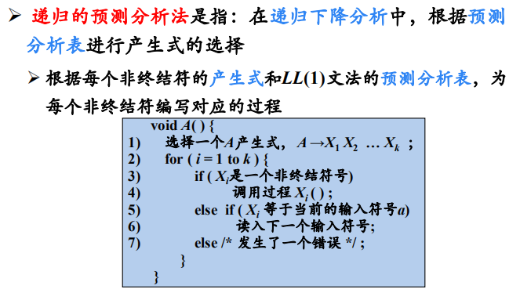

****

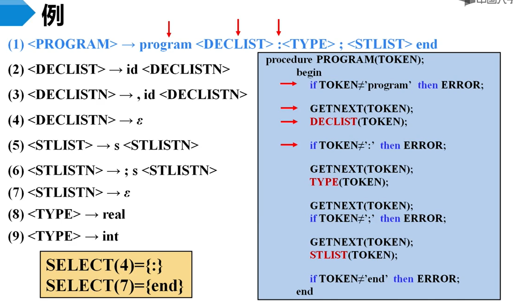

是终结符操作，那么就把它写死，如果中间过程无法匹配，即应该进行跳过

## 4-6 非递归预测分析法

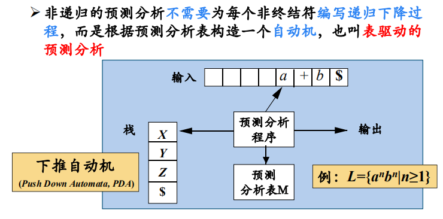

注意到，有穷自动机的识别功能不强，是因为其记忆功能有限，在这里我们使用表驱动，利用栈结构可以对历史进行一定的存储

### 一个推导

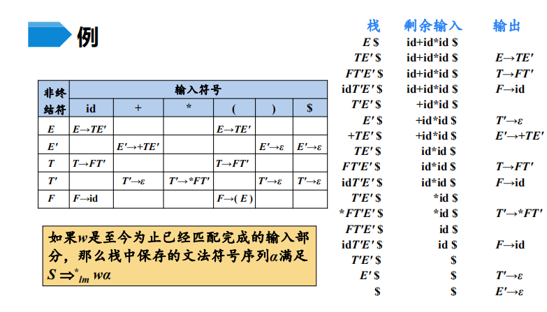

注意这个输出序列就是产生式的最左推导

****

### 递归分析法与非递归法的比较

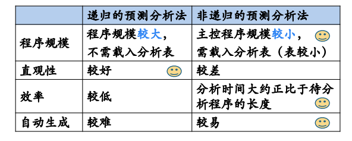

注意到非递归的这个法，可以用有穷自动机辅助推导，所以说其可以自动生成

****

###  预测分析法的实现步骤总结

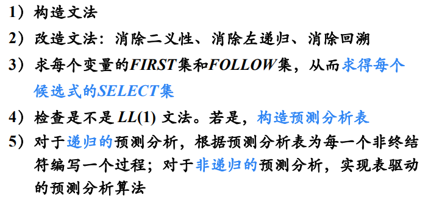

## 4-7 预测分析中的错误处理

###  常见错误

### 恐慌模式

> 进行错误的恢复

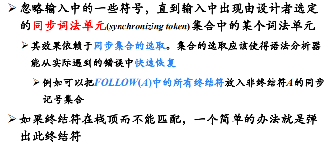

即过谁错了，比如A这个推导错了，就放弃A的识别FOLLOW（A）中集合出现的时候就立即进行同步

# 第六讲 语法分析_3_

## 4-8 自底向上分析概述

### 自底向上语法分析

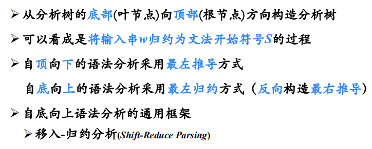

### 移入-规约分析

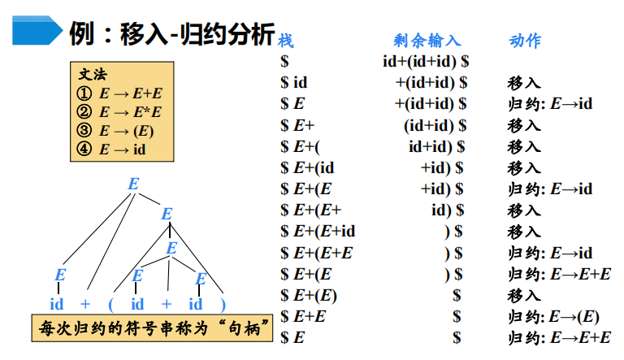

#### 工作过程

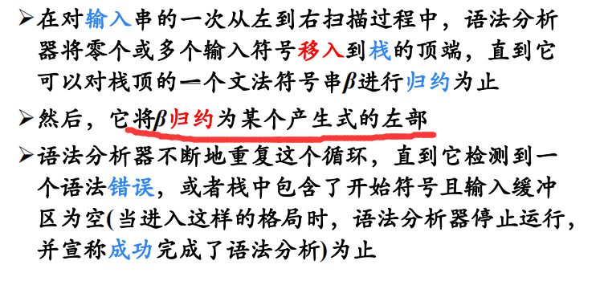

#### 四种动作

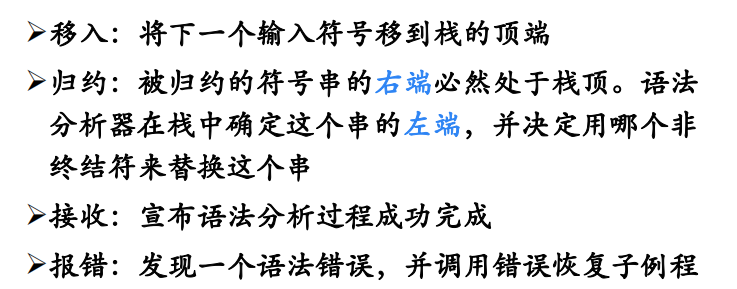

注意，这个分析过程中可能会错误地识别句柄

**句柄**：句型的最左直接短语，子树高度为2的边缘部分

## 4-9 LR分析法概述

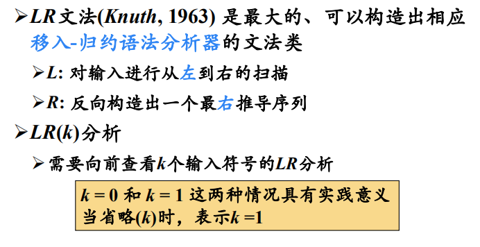

### LR分析算法

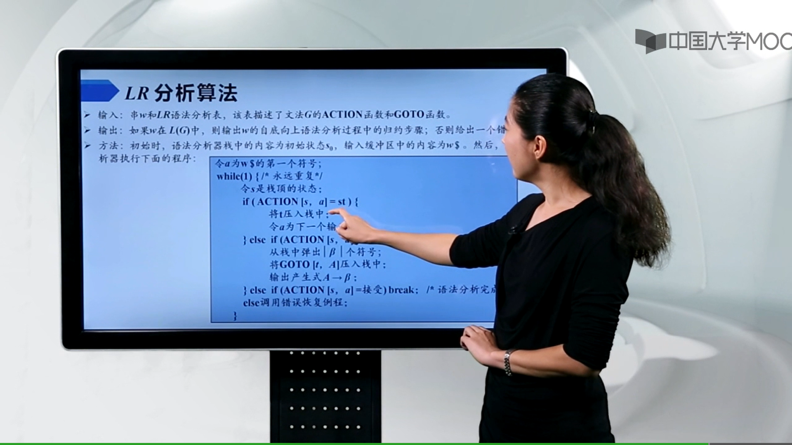

####  LR算法基本原理

句柄 逐步形成的，用”状态“表示句柄识别的进展程度

### LR分析表的结构

### 注意分析器的工作过程

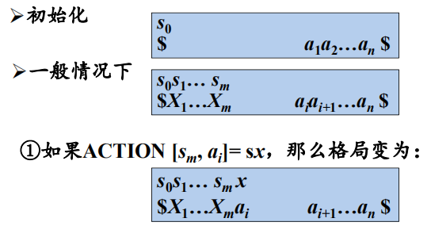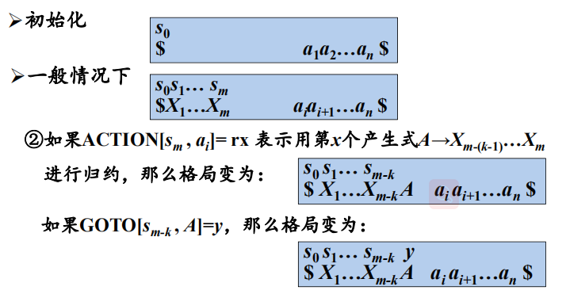

## 4-10 LR（0）分析

### LR（0）项目

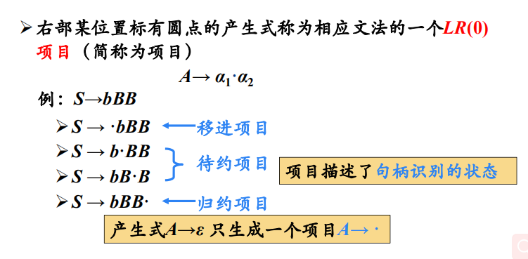

### 增广文法

### 文法中的项目 （需要能够判断等价的情况来减少冗余的发生）

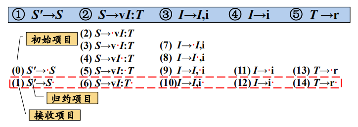

#### 后继项目

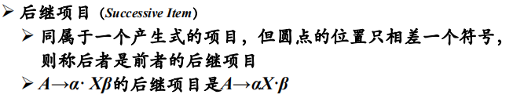

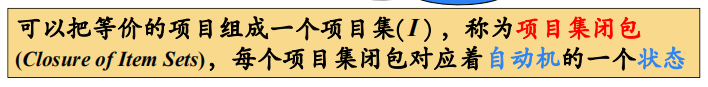

可以记录，当一个项目中原点的右侧为非终结符的时候，它就存在等价项目

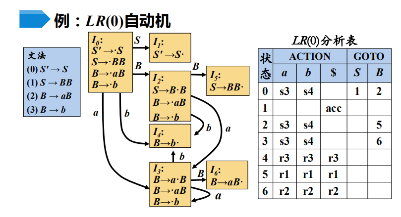

## 4-11 LR（0）分析表构造

# 题目

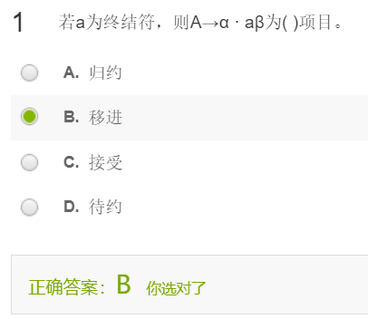

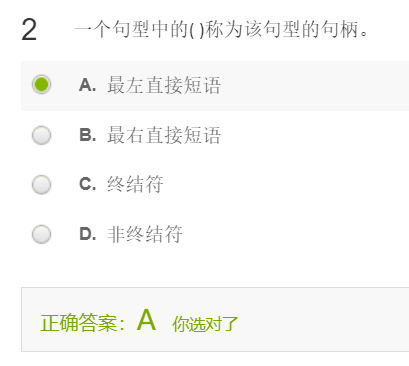

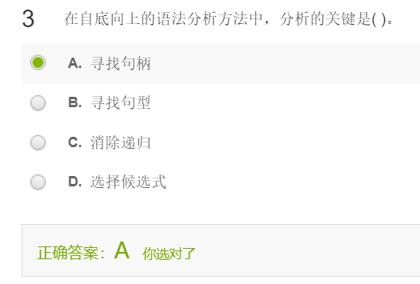

自底向上的语法分析关键是 ：寻找句柄（最左直接短语）

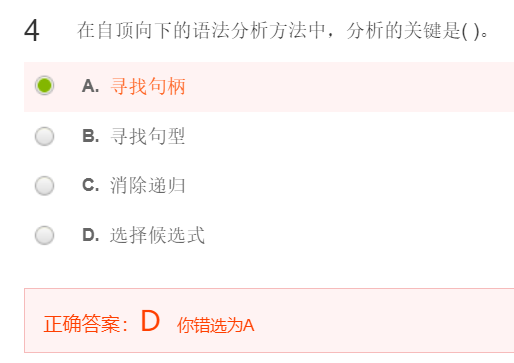

自顶向下的语法分析关键是： 选择候选式

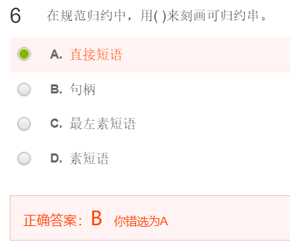

在规范规约中，可以用句柄来刻画可规约串

