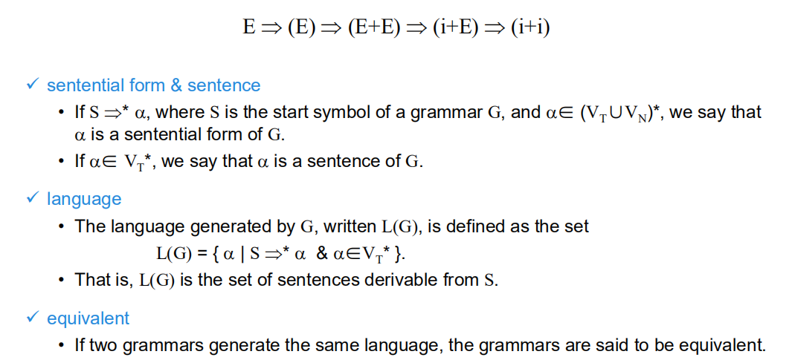

# 语法分析

## 4.2 上下文无关文法

注意四元组的定义 

​	用来描述语言的语法结构

### 最基本的语法单元

表达式：程序设计里面的基本单元

注意后两项，分别对应着开始状态和产生式

自己由自己组成，就是递归。。

### 巴克斯范式 BNF

### 4.2.2 Notational Conventions

以上即对终结符和非终结符做出了一定的划分

****

只有全由终结符构成句型才能叫句子

### 左递归与右递归

## 最左推导和最右推导

每一次都选择最左侧的非终结符进行推导

### 4.2.4 语法分析树

#### 一个句子是不是一一对应唯一的语法分析树

