# week5 mooc 编译原理 第七讲 语法分析\_4

## 4-12 SLR分析

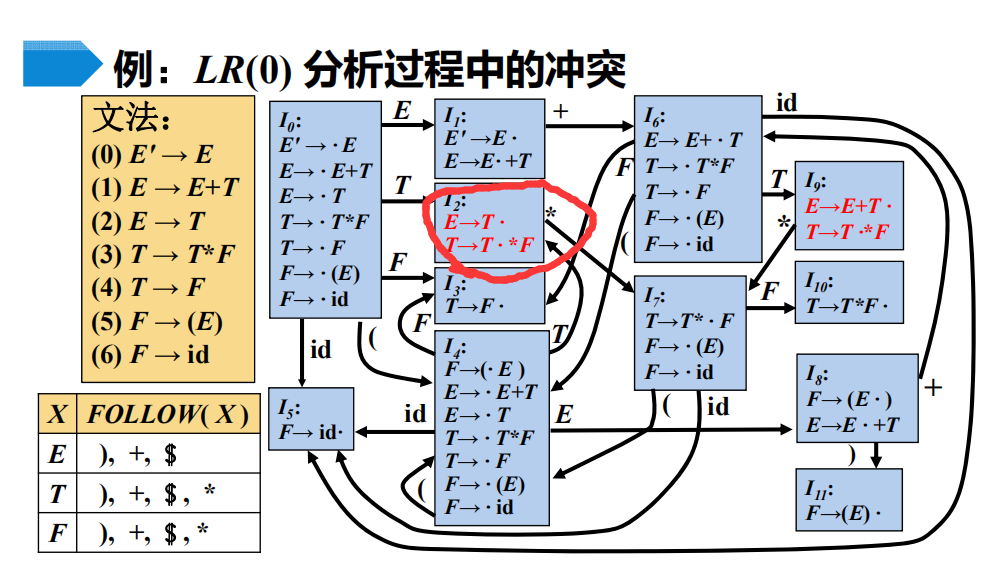

我们会遇到是否需要规约的矛盾

lr（0） ，向前看了0个符号，没有考虑上下文环境

follow集可以帮我们判断在哪些情况下不进行规约动作

### SLR分析

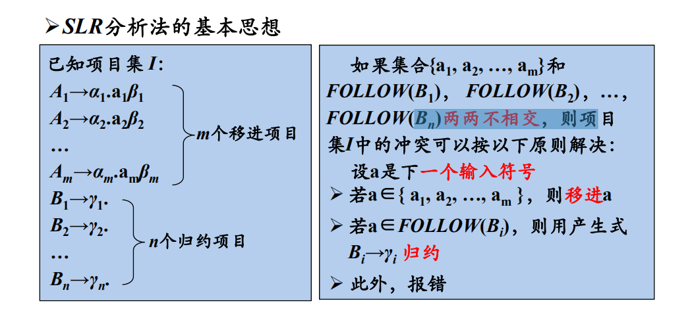

说它简单，是因为它只用follow集就可以化解冲突

****

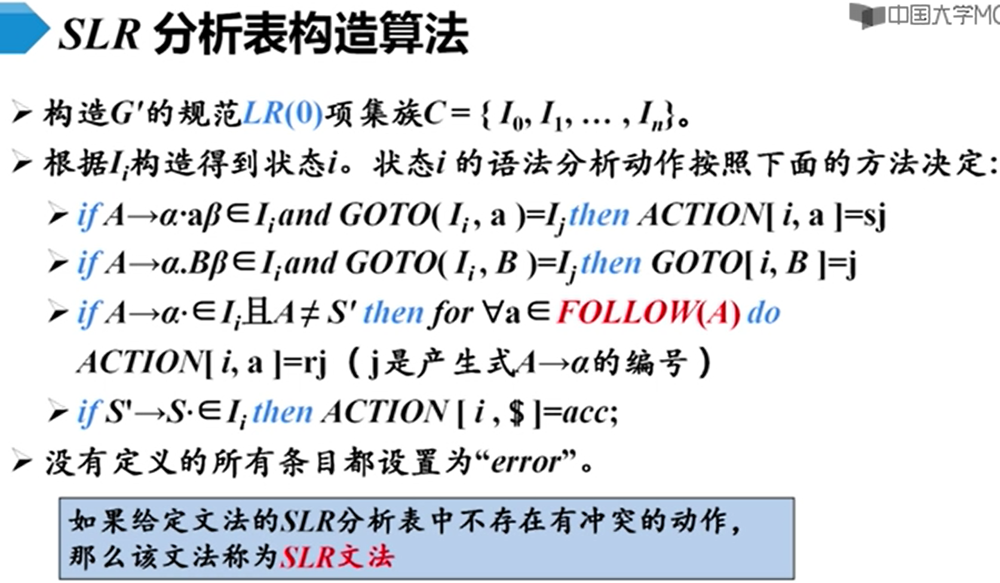

## 4-13 LR（1）分析

###  分析法的提出

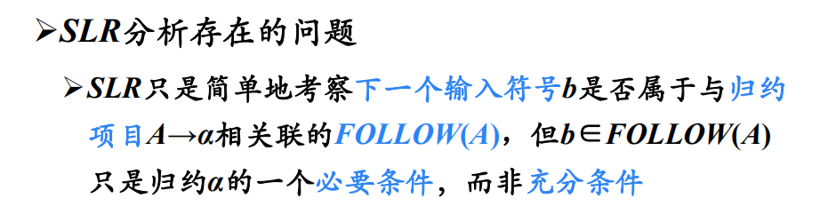

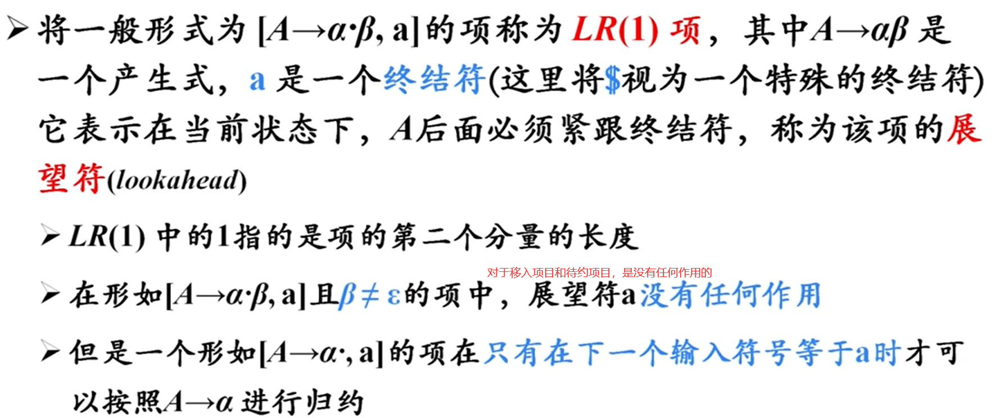

****

###  等价LR（1）项目

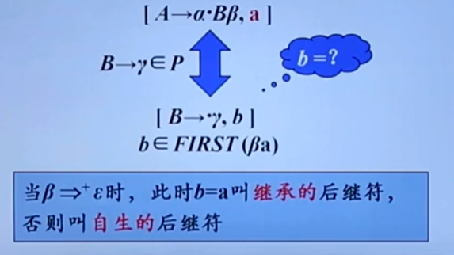

LR(1)产生的状态要比SLR要多；

细化输入信息，将状态分裂的结果

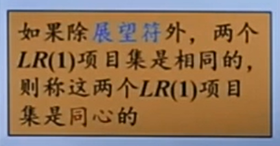

### LR（1） 项目集闭包的计算

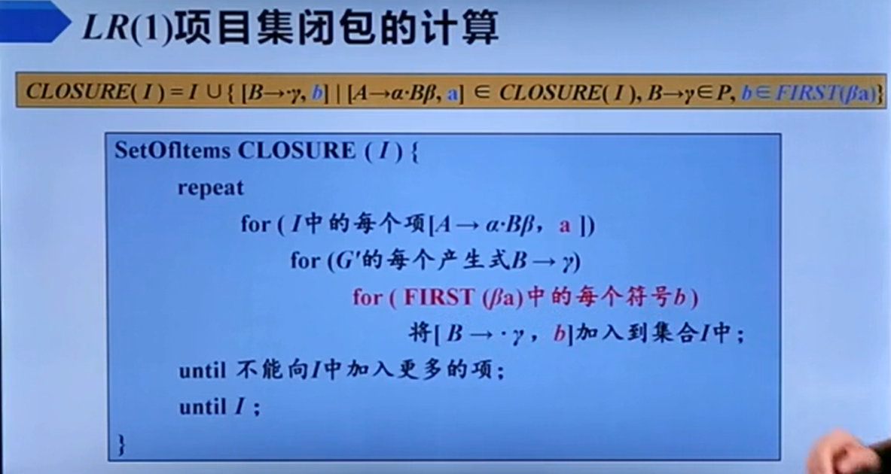

能规约的我都列出来，展望符和左部本出现过的搭配即可

****

### 4-14 LALR 分析法

LR（1） 存在同心项的集合，对这些集合的划分，我们是根据展望符的差别进行划分的；

所以可能会增多了很多冗余的状态；

**为了让技术实用化，我们要减少状态数量**

### 基本思想

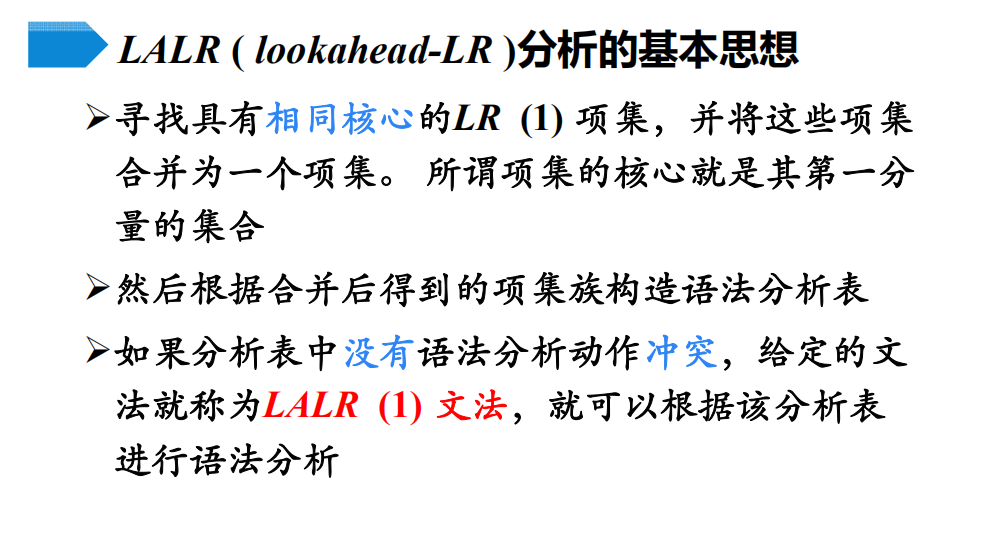

****

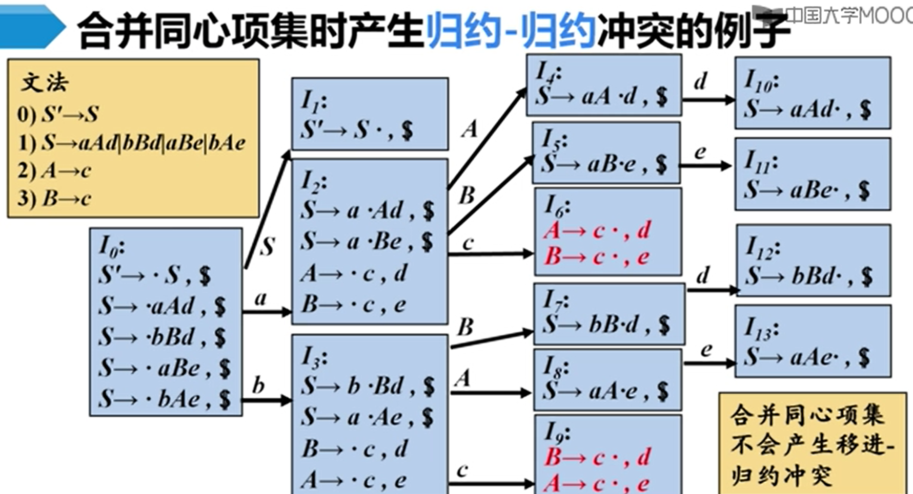

注意到展望符只在规约的时候起作用，我们之前已经确保了产生式部分是同心，是完全一样的了。就可以保证不会产生移进-规约冲突

### 但是可能会推迟错误的发现

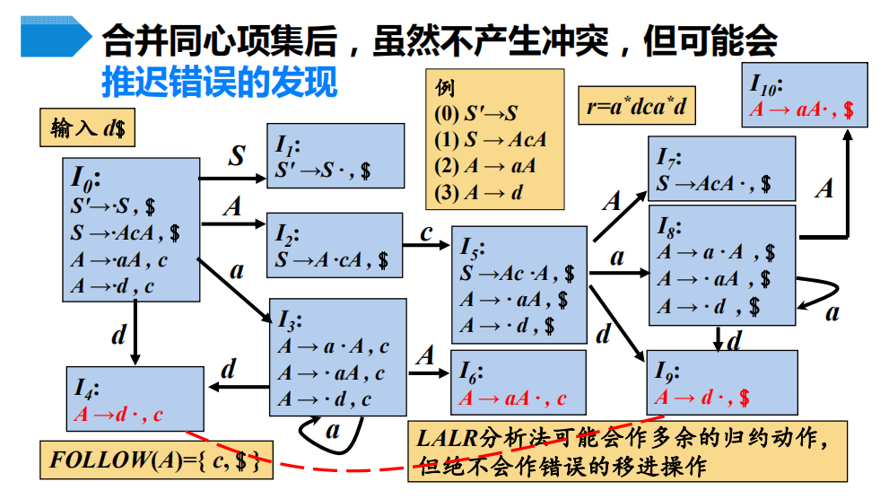

合并同心项目集不会影响移入项目的正确性

### LALR（1）特点

- 形式上与LR（1）相同
- 大小上与LR（0）/SLR相当
- 分析能力介于SLR和LR（1）二者之间
- 合并后的展望符集合仍然是follow集的子集

## 4-15 二义性文法的LR分析

### 二义性文法的特点

- 每个二义性文法都不是LR的

- 某些类型的二义性文法在语言的描述和实现中更有用
  - 更简短、更自然

二义性LR文法的冲突可以使用算术运算符的优先级以及结合性来进行必要的消解

虽然有好处，但是我们也需要去谨慎的使用

## 4-16 LR分析中的错误处理

- 语法错误的检测
- 错误恢复策略
  - 恐慌模式错误恢复
  - 短语层次错误恢复

## 题目

### 1

### 2

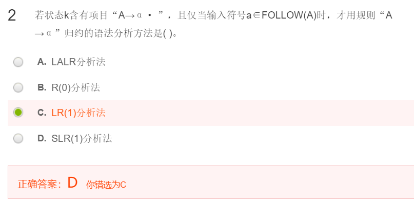

### 3

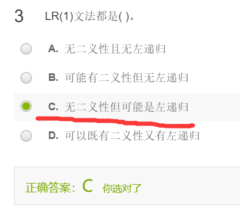

### 4

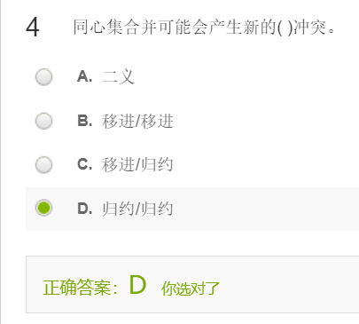

### 6

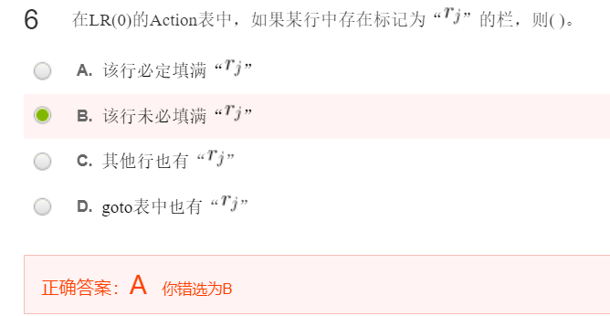

### 8

