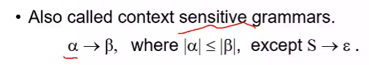

# week5 编译原理 罗

表达式是最基本的数据单元

tiny中有五种类型的语句

if 和 repeat

定义的时候要注意，用什么来定义分隔符

注意第一行的例子是右结合的，

且产生式有多个的时候，位于下方的产生式具有较高的优先级

## Program

程序是由语句序列构成的

****

## 4.2.7， 4.3.5

### 三型文法 正则文法

这个左和右，指的是产生式右部的非终结符（可能出现）的位置是在最左侧还是最右侧

正则文法和正则表达式是等价的关系，

第二个产生式可以抽象为

我们转换成一个类似求方程组的问题

eg:

注意对空串的处理方式，不能直接消失，取并集的时候是获得并的元素自己

这种语言表达能力是最弱的

### 2型文法

### 1型文法

上下文有关文法，约束条件更少了

箭头左侧符号串的长度比右侧小于等于

### 0型文法

有正则还要继续分：

1. 模块化，维护，移植都更容易
2. 词法规则更简单，没有必要非要用文法规则来表示

3. 直观，容易理解，有自己的优势
4. 效率上来讲，根据词法构造出的效率比文法构造出的效率更高

## 作业

