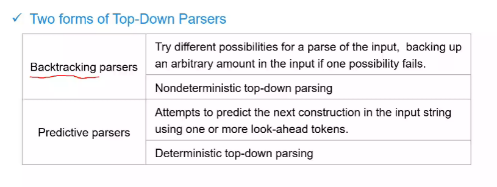
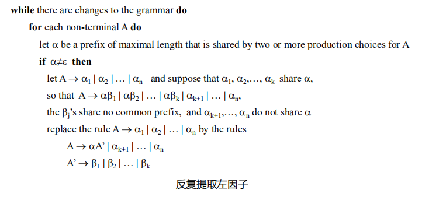
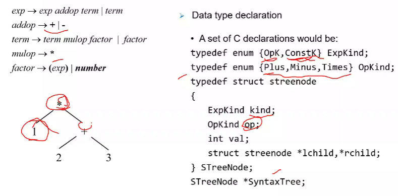

# week6 编译原理 罗

## 作业点评

基本上就是复习词法分析部分的内容，没有什么问题


看体面来决定要用什么算法去构造NFA

****

可以尝试直接画这个


## 4.4 top-down parsing 自顶向下的分析



一种是带回溯的，一种是不带回溯的。

前者会尝试各种分析路径


课程设计可以选择**递归下降**或者**LL1**，这两种语法分析方法

### RDP 递归下降的语法分析

在上下文无关文法基础之上分析，看做是对A有更清晰的认识，更清楚的一个识别过程。


终结符就要进行一定的匹配，如果他们一致，就意味着匹配上了

四个关键词：

- terminals -> matches 如果终结符一致就进行匹配操作
- norterminals 有自己的过程或函数 -> calls 执行调用操作

****

- token保持了一个look-ahead的隐含条件


> 注意在这里token是一个全局变量，实际上不太合适

****


### Problems 例子


左递归让我们很不确定，且有回溯

****

### 改写左递归，左回溯 rewrite grammers using EBNF(nonden，容易实现)

EBNF 两个问题 

- 存在重复
- 存在可选的内容

#### 重复

各种递归现象的存在。

用{...}来表示重复


一个例子

第一项就变成了term，不会一直对第一句话进行重复了


可以不用生搬硬套


term -> factor { mulop factor}

```
procdure term;
begin
	factor;
	while mulop = *
		match(token)
		factor;
	end while;
end term;
```

上述就是简单算术表达式的递归下降分析过程

****

#### choice 可选

最经典的问题就是IF语句


###  Rewrite grammers using BNF

> 

### 4.3.3 Elimination of Left Recursion


E - > TE'

E' ->  + TE'| e 他的重复由右递归来实现

T - > FT'

T' -> \*T\' | e

#### 一种通用左递归的形式


E -> TE'

E'->+T E'|- T E' | e

####  间接左递归

seq->s seq'

seq' -> ; s seq' | e

### 4.3.4 Left Factoring

有左公因子的问题，会出现回溯的问题，加入了这个提取的动作，可以保证各写各的


#### 基本算法 algorithm 4.21



可以手工剔除左因子和左递归，然后编写代码

****


虽然没有相同前缀，但是会看着不让人明白


****


### Right Associativity 右结合问题

其实就是左结合的问题做一点点修改就可以实现


## 抽象语法树 Abstract Syntax Tree


****

二叉树要能体现出节点类型的区别

#### 表达式



****


左右括号主要是体现一个优先级的作用


****


但是这种情况不够理想，子节点的数量是写死的

****


### 一个语法树的例子


## FIRST 集和 FOLLOW集


所有串首终结符的集合


有以下规则

- 

- 

- 

  - 如果是非终结符，则其肯定有一个产生式

  - 

  - 

  - 

    

    


****


****


first(F) = {\(, i}

first(T') = {\*, e}

first(T) = first(F)

first(E') = { +, e}

first(E) = {(, i)}

****


first(C) = {c, g, e}  // 全是以终结符开头的

first(B)  = {b, f, e}

first(A) = {a, e}

first(S) = {a} +{b,f} + {c,g} +{d}

****


first(D) = {a,b}

first(R) = {d,e}

first(T) = { a,b,e}

first(S) = {E} + {d} + {a,b} + {e}  //因为非终结符组合在一起，前面的非终结符若存在空串，则可能消失，于是就要考虑其后的非终结符的情况