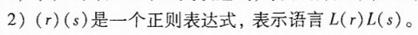
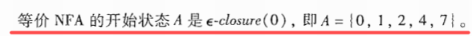
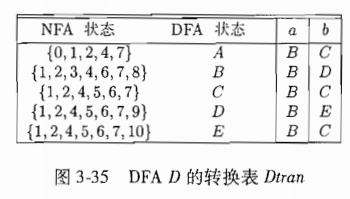
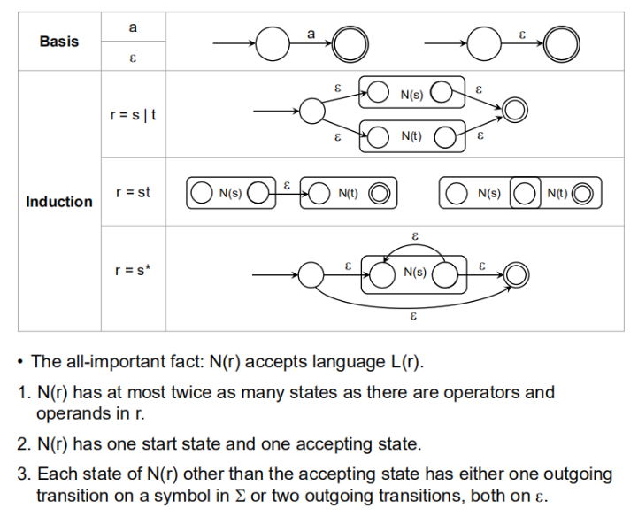
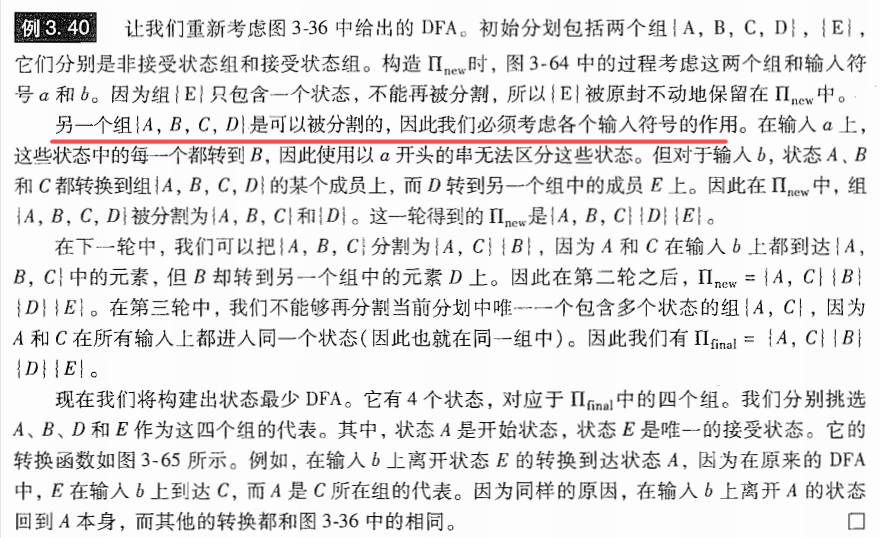
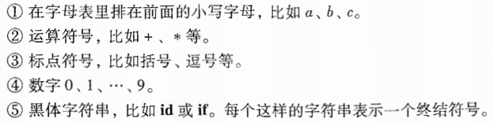
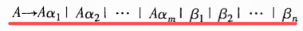
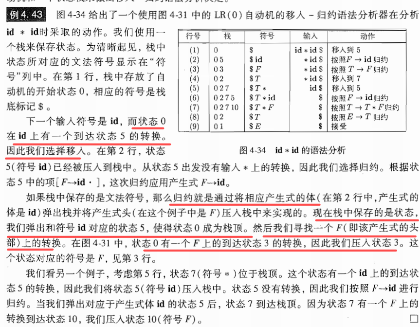
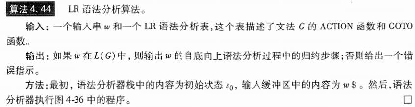
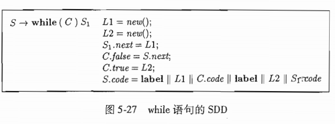

# 编译原理期末复习_bookv1_

## 第一章 introduction

### 1.1 语言处理器

一个编译器就是一个程序，它可以阅读某一种语言编写的程序。并把该程序翻译成为一个等价的，用另一种语言（目标语言）编写的程序。

如果目标程序是一个可执行的机器语言。那么它就可以被用户调用，处理并产生输出。

**解释器（interpreter）**是另一种常见的语言处理器。它并不通过翻译的方式产生目标程序。从用户的角度看，解释器直接利用用户提供的输入执行源程序中的指定操作

对比：在把用户输入映射成为输出的过程中，由一个编译器产生的机器语言目标程序通常比一个解释器**快很多**。然而**解释器的错误诊断效果**通常比编译器好，因为它逐个语句地执行源程序。

### 1.2 一个编译器的结构

> 如果看成黑盒子，它能够把源程序映射为语义上等价的目标程序。大致把这个映射过程分为两部分，即分析部分和综合部分。
>
> 分析analysis
>
> 综合synthesis
>
> 分析部分通常被称为编译器的前端front end，综合部分称为后端back end

#### 1.2.1 词法分析

词法分析lexical analysis也可称为扫描scanning。

读入：组层源程序的字符流

组成：有意义的**词素**序列

****

**词素**lexeme，对于每个词素，词法分析器产生如下的词法单元

词法分析输出可以作为前端部分的下一项，即语法分析的输入内容

#### 1.2.2 语法分析

编译器第2个步骤称为语法分析syntax analysis或者解析parsing。

作用：给出了词法分析产生的词法单元流的语法结构。

常用表示方法：语法树syntax tree。树种的点代表一个运算，而该店的子节点表示该运算的分量。

#### 1.2.3 语义分析

使用语法树和符号表中的信息来检查源程序是否和语言定义的语义一致。它同时也收集类型信息，并把这些信息存放在语法树或符号表中，以便随后的中间代码生成过程中使用

**类型检查type checking**: 编译器检查每个运算符时候具有匹配的运算分量。比如数组的下标必须是整数。如果此时采用浮点数作为数组下标，编译器就必须报告错误。

#### 1.2.4 中间代码生成

把一个源程序翻译成目标代码的过程中，一个编译器可能构造出一个或多个中间表示。这些中间表示可以有多重形式，语法树是一种中间表示形式，它们通常在语法分析和语义分析中使用。

很多源程序的语法分析和语义分析完成后，会产生一个类机器语言的中间表示（某个抽象机器的程序）。应该具有两个重要性质：

- 易于生成
- 能够被轻易地翻译为目标机器上的语言

#### 1.2.5 代码优化

机器无关的代码优化步骤试图改进中间代码，以便生成更好的目标代码。

注意，这个更好可以意味着很多不同的目的，比如更快的生成，或者生成更短，能耗更低的目标代码。

#### 1.2.6 代码生成

代码生成器以源程序的**中间表示**作为输入，把它映射到目标语言。如果目标语言是机器代码，那么它就必须为程序使用的每个变量选择寄存器或内存位置。

代码生成的一个直观重要的方面是合理分配寄存器以存放变量的值

#### 1.2.7 符号表管理

记录源程序中使用的变量的名字，并收集和每个名字的各种属性有关的信息。这些属性可以提供一个名字的存储分配、它的类型、作用域等信息。

对于**过程名字**这些信息还包括：它的参数数量和类型、每个参数的传递方法（比如传值或传引用）以及返回类型。

符号表数据结构为每个变量名字创建了一个记录条目。记录的字段也就是各个名字的各个属性。这个数据结构应该允许编译器循序查找到每个名字的记录，并向记录中快速存放和获取记录中的数据。

#### 1.2.8 将多个步骤组合成趟

在一个特定的实现中，多个步骤的活动可以被组合成一趟。每趟读入一个输入文件并产生一个输出文件。

分出了pass的概念，我们可以把不同的前端和某个目标机的后端结合起来，为不同的源语言简历该目标机上的编译器

#### 1.2.8 编译器的构造工具

- 语法分析器的生成器：根据一个程序设计语言的语法描述自动生成语法分析器
- 扫描器生成器：根据一个语言的语法单元的正则表达式描述生成词法分析器
- 语法制导翻译引擎：可以生成一组用于遍历分析树并生成中间代码的例程。
- 代码生成器的生成器：依据一组关于如何把中间语言的每个运算翻译成为目标机上的机器语言的规则，生成一个代码代码生成器。
- 数据流分析引擎：可以帮助收集数据流信息，即程序中的值如何从程序的一个部分传递到另一个部分。数据流分析是代码优化的一个重要部分。
- 编译器构造工具集

## 第二章 A Simple Syntax-Directed Translator

### 2.7 符号表 symbol table

> 是一种供编译器用于保存有关源程序构造的各种信息的数据结构。这些信息在编译器的分析阶段被逐步收集并放入符号表，他们在综合阶段用于生成目标代码。符号表的每个条目中包含一个与标识符相关的信息
>
> 符号表通常需要支持统一标识符在一个程序中的多重声明。（不同位置不同作用域但是符号表示是一样的）

#### 2.7.2 符号表的使用

## 第三章 词法分析

#### 3.1 词法分析器的作用

任务：读入源程序的输入字符、将他们组成词素，生成并输出一个词法单元序列，每个词法单元对应于一个词素。

得到的词法单元被输出到语法分析器中进行语法分析

词法分析器可以分为两个级联的处理阶段：扫描阶段、词法分析阶段

#### 3.1.1 词法分析及语法分析

首先明确编译过程的前端分析部分分解成词法分析和语法分析两个阶段的原因有：

- 最重要的考虑是简化编译器的设计。
- 提高编译器的效率。（将词法分析器独立出来可以使用更专注于词法分析任务、不进行语法分析技术。
- 增强编译器的可以执行。输入设备相关的特殊性可以被限制在词法分析器中。

#### 3.1.2 词法单元、模式和词素

##### 几个术语

- 词法单元：一个词法单元名和一个可选的属性值组成。
- 模式：描述了一个词法单元可能具有的形式。（即表明了这个的含义，正则表达，含有什么字符的那种感觉）
- 词素：源程序中的一个字符序列，它和某个词法单元的模式匹配，并被词法分析器识别为该词法单元的一个实例。

##### 通常的分类

- 每个关键字有一个词法单元
- 表示运算符的词法单元
- 一个表示所有标识符的词法单元
- 一个或多个表示常量的词法单元
- 每个标点符号有一个词法单元

####  3.1.3 词法单元的属性

如果有多个词素可以和一个模式匹配，那么词法分析器必须向编译器的后续阶段提供有关被匹配词素的附加信息（比如是类型，第一次出现的位置，他们或都保存在符号表中）。一个标识符的属性是一个指向符号表中该标识符对应条目的指针。

#### 3.1.4 词法错误

没有其他组件的帮助，单一的词法分析器很难发现源代码中的错误。

假设所有词法单元的模式都无法和剩余输入的某个前缀匹配的情况，此时词法分析器就不能继续处理输入。 通常最简单的错误恢复策略就是“恐慌模式”恢复。**即从剩余的输入中不断删除字符，直到词法分析器能够在剩余输入的开头发现一个正确的词法单元为止**。

### 3.3 词法单元的规约

正则表达式是一种用来描述词素模式的重要表示方法。

#### 3.3.1 串和语言

某个字母表上的一个串string是该字母表中符号的一个有穷序列。

语言language是某个给定字母表上一个任意的可数的串集合

#### 3.3.2 语言上的运算

最重要运算是并、连接和闭包运算。

#### 3.3.3 正则表达式

**归纳基础：**

- 
- 

**归纳步骤：**假设r和s都是正则表达式，分别表示语言L(r)和L(s)

- 
- 
- 
- 

可以采用如下的约定，可以丢掉一些括号：

可以用一个正则表达式定义的语言叫做正则集合（regular set）。如果两个正则表达式r和s表示相同的语言，则称r和s等价，记作r=s。正则表达式它满足一些代数定律。

#### 3.3.4 正则定义

regular definition

#### 3.3.5 正则表达式的扩展

（2020/5/20 号发现课后练习感觉题型很不错，回过头来可以复习参考用）

### 3.4 词法单元识别

学习如何根据各个需要识别的词法单元的模式来构造出一段代码。

#### 3.4.1 状态转换图

状态转换图transition diagram有一组称为状态的结点或圆圈。

**重要约定**：

#### 3.4.2 保留字和标识符的识别

处理很像标识符的保留字的方式：

- 初始化时就将各个保留字填入符号表总
- 为每个关键字建立单独的状态转换图（我们构建词法分析器的时候就是这种状态）

#### 3.4.3 完成我们的例子（接上一节）

#### 3.4.4 基于状态图的词法分析器的体系结构

用变量state保存状态图当前状态的编号

用switch语句根据state的状态将我们转到对应于各个可能状态的相应代码段

一些改进策略：

- 我们可以让词法分析器顺序地尝试各个词法单元的状态转换图。（但每个关键字，每种表示符都用各自独立的状态图，效率还是不高，可能会对很多字符串不断地重复操作）
- 可以并行地运行各个状态转换图，将下一个输入字符提供给所有的状态转换图，并使得每个状态转换图作出它应该执行的转换。（但是这样的话，由于每种分析器特点的不同，对这个字符流的操作要求就挺多的。为了实现这种并行，代码设计上和对内存空间可能都另有要求。
- 更好的方法是，也是通常最普遍的方式，就是将所有状态转换图合并为一个图。允许合并后的转换图尽量读取输入，直到不存在下一个状态为止

#### 3.6  有穷自动机

虽然与 状态转换图类似，但是有几点是不同的：

- 有穷自动机是识别器（recognizer），只能对每个可能的输入串回答1或0
- 有穷自动机分为两类：
  - NFA，对其边上的标号没有任何限制。一个符号标记离开同一状态的**多条边**，并且空串e也可以作为标号
  - DFA，对于每个状态及自动机输字母表中的每个符号，有且只有**一条**离开该状态，以该符号为标号的**边**

但DFA和NFA能识别的语言集合是相同的。这些语言的集合正好是能够用正则表达式描述的语言的集合。这个集合中的语言被称为正则语言（regular language）

#### 3.6.1 不确定的有穷自动机

几个组成部分：

- 
- 
- 
- 
- 

#### 3.6.2 转换表（用表的形式展现NFA）

即各行对应于状态，各列对应于输入符号和e。

如果转换函数没有给出对应于某个状态 - 输入对的信息，我们把 空集 放入相应的表项中。

#### 3.6.3 自动机中输入字符串的接受

一句话：一个NFA accept输入字符串x，当且仅当对应的转换图中存在一条从开始状态到某个接受状态的路径，使得该路径中各条边上的标号组成符号串x，且路径中的空串e标号将被忽略（因为空串不会影响到根据路径构建得到的符号串。

由一个NFA定义的语言是从开始状态到某个接受状态的所有路径上的标号串的集合。

#### 3.6.4 确定的有穷自动机

DFA是NFA的一个特例，其特点在于：

- 没有输入空串的转换动作
- 对于每个状态s和每个输入符号a，有且只有一条标号为a的边离开s

### 3.7 从正则表达式到自动机

#### 3.7.1 从NFA到DFA的转换

“子集构造法”：让构造得到的DFA的每个状态都对应于NFA的一个状态集合（把状态数目缩小）。

、

例子：

当所有的状态都加上标记之后，就可以得到一个DFA的转换表

#### 3.7.2 NFA的模拟

#### 3.7.3 NFA模拟的效率

#### 3.7.4 从正则表达式构造NFA

汤普森算法：

这个只要知道怎么套用这三组模式就可以，让我们能根据正则表达式把NFA画出来即可。

实际操作起来没有必要画出语法分析树，再自底向上考虑，反而麻烦了。

### 3.9 基于DFA的模式匹配器的优化

#### 3.9.6  最小化一个DFA的状态数

概括来说，注意两点

1. 状态集合和接收集合
2. 蔓延条件，在所有符号上判别是否等价（即接收敷好之后的状态是否仍处于同一集合，不同则将该集合划分出来）

****

具体例子：

## 第四章 语法分析

### 4.1 引论

#### 4.1.1 语法分析器的作用

语法分析器从词法分析器获得一个由词法单元组成的串，并验证这个串可以由源语言的文法生成。同时我们期望语法分析器能够以易于理解的方式报告语法错误，并且能够从常见的错误中恢复并继续处理程序的其余部分。

#### 4.1.2 代表性的文法

形如：

有“二义性”这个概念的存在

### 4.2 上下文无关文法

#### 4.2.1 上下文无关文法的正式定义

一个上下文无关分发由终结符号、非终结符号、一个开始符号和一组产生式组成

- 终结符号是组成串的基本符号。注意，术语”词法单元名字“是”终结符号“的同义词。
- 非终结符号是表示串的集合的语法变量
- 在一个文法中，某个非终结符号被指定为开始符号。且这个符号表示的串集合就是这个文法生成的语言
- 一个文法的产生式描述了将终结符号和非终结符号组成串的方法。每个产生式由下列元素组成
  - 

#### 4.2.2 符号表示的约定

- 终结符号
  - 
- 非终结符
  - 
- 在字母表中排在后面的大写字母表示文法符号。可表示非终结符号或终结符号。如（X、Y、Z)
- 在字母表中排在后面的小写字母表示终结符号
- 小写的希腊字母，α，β，γ表示文法符号串。
- 
- 

#### 4.2.3 推导

自底向上语法分析和一种被称为最右推导的推导类型相关，即每一步重写的都是最右边的**非终结符号**

一个句型可能既包含终结符又包含非终结符号，也可能是空串。

文法G的一个**句子**sentence是不包含非终结符号的句型。（判断是否是该文法的一个句子，直接可以通过这个文法能否推导出这个串即可）

一个文法生成的**语言**是它的所有句子的集合。

可以由文法生成的语言被称为上下文无关语言（CFL），如果两个文法生成相同的语言，这两个文法就被称为是等价的。

通常存在两种推导过程：

1. 最左推导 leftmost derivation，选择每个句型的最左非终结符号。如果α => β是一个推导步骤，且被替换的是α中的最左非终结符号，我们写作
2. 最右推导 rightmost derivation， 选择最右边的非终结符号，此时我们写作

#### 4.2.4 语法分析树和推导

语法分析书忽略了句型中符号的不同顺序。我们通常还是使用最左推导或最右推导来进行语法分析

#### 4.2.5 二义性

如果一个文法可以为某个句子产生多棵语法分析树，那么他就是二义性的ambiguous。换句话说对同一个句子，有多个最左推导或多个最右推导文法。

大多数的语法分析器期望文法是无二义性的，否则就不能为一个句子唯一地选定语法分析树。但是有些情况下未经过精心选择的二义性文法也可以带来方便。但是同时我们要使用 消二义性规则来抛弃不需要的语法树

#### 4.2.6 验证文法生成的语言

#### 4.2.7 上下文无关文法和正则表达式

### 4.3 设计文法

#### 4.3.1 词法分析和语法分析

为什么用正则表达式来定义一个语言的词法语法

- 将一个语言的语法结构分为词法和非词法两部分可以很方便地将编译器前端模块化，将前端分解为两个大小适中的组件。
- 一个语言的词法规则通常很简单，我们不需要使用像文法这样的功能强大的表示方法来描述这些规则
- 和文法相比，正则表达式通常提供了更加简洁且易于理解的表示词法单元的方法
- 根据正则表达式自动构造得到的词法分析器效率要高于根据任意文法自动构造得到的分析器。

通常来说，正则表达式最适合：

​	描述诸如标识符，常量，关键字，空白这样的语言构造的结构。

另一方面，文法最合适描述嵌套结构：

​	括号对，匹配的begin-end，if stmt等

#### 4.3.2 消除二义性

需要在文法中具体的说明某些标识符的结合性，匹配性

#### 4.3.3 左递归的消除

处理直接左递归

替换为：

处理间接左递归（不知道会不会考）

****

#### 4.3.4 提取左公因子

最经典的就是if-stmt的共同前缀提取操作

#### 4.3.5 非上下文无关语言的构造

### 4.4 自顶向下的语法分析

自顶向下语法分析可以被看做是输入串构造语法分析书的问题，它从语法分析树的根节点开始，按照前序遍历（DFS）创建这棵树的各个节点。自顶向下语法分析也可以被看做寻找输入串的**最左推导**的过程。

预测分析技术是递归下降分析技术的一个特例，它不需要进行回溯，它通过在输入中向前看固定多个符号来选择正确的A产生式。而通常我们只需向前看一个符号（下一个输入符号）

#### 4.4.1 递归下降的语法分析

注意到，一个左递归的文法会使它的递归下降语法分析器进入一个无限循环。即使是带回溯的语法分析器也是如此。

#### 4.4.2 FIRST集合和FOLLOW集合（会算！即可）

FIRST集合：

注意限制条件：

FOLLOW集合：

****

****

计算FOLLOW的时候要从开始符号开始，不断的迭代直到没有集合发生更新为止。

#### 4.4.3 LL1文法

构造 预测分析器，向前看一步。LL中第一个L表示从左向右扫描输入，第二个L表示产生最左推导。

LL1文法必须满足的条件：

接下来就是利用FIRST集合和FOLLOW集合的内容来构造预测分析表。我们可以进行如下处理

形如这个即可：

#### 4.4.4 非递归的预测分析

这样的语法分析器模拟的是最左推导的过程。

整个分析过程形如这样，注意栈底符号的位置：

****

### 4.5 自底向上的语法分析

#### 4.5.1 规约

将自底向上的语法分析过程看成将一个串 w 规约为文法开始符号的过程。 在每个规约reduction步骤中，一个与某产生式体匹配的特定子串将被替代为该产生式头部的非终结符号。

一次规约是一个推导步骤的反向操作。自底向上语法分析的目标是反向构造一个推导过程。

#### 4.5.2 句柄剪枝（！！！！）

句柄剪枝，或者说找句柄，可以形象的理解为是一个最左规约的过程，即这个过程也能得到一个反向的最右推导。

从输入的串开始，我们找一个产生式，能够完成规约的话，则该产生式的右部可记录为其句柄。

****

#### 4.5.3 移入- 规约语法分析技术

一个移入-规约语法分析器可采取的动作有：

- 移入shift：将下一个输入符号移到栈顶
- 规约reduce：被规约的符号串的右端必然是栈顶。语法分析器在栈中确定这个串的左端（从左起最早可以被替代的部分），并决定用哪个非终结符来替换这个串。
- 接受accept 宣布语法分析过程成功完成
- 报错error：发现一个语法错误，并调用一个错误恢复子程序

注意一个重要性质：句柄总是出现在栈顶。

#### 4.5.4 移入- 规约语法分析中的冲突

需要定义更清晰的产生式成分，减少重名和歧义

### 4.6 LR语法分析技术介绍：简单LR技术

#### 4.6.1 为什么使用LR语法分析器（表格驱动的）

直接来说：只要存在这样一个左到右扫描的移入-规约语法分析器，它总是能够在某文法的最右句型的句柄出现在栈顶时识别出这个句柄，那么就是LR文法。

吸引力所在：

- 几乎所有程序设计语言，只要能够写出构造该文法的上下文无关文法，就能够构造出识别该构造的LR语法分析器。
- LR语法分析方法是已知的最通用的无回溯移入-规约分析技术，并且它的实现可以喝其他更原始的移入 - 规约方法一样高效。
- 一个LR语法分析器可以在对输入进行从左到右扫描时尽可能早地检测到错误。
- 可以使用LR方法进行语法分析的文法类是可以使用预测方法或LL方法进行语法分析的文法类的真超类。

缺点就是手工构造LR分析器工作量非常大。

#### 4.6.2 项和LR（0）自动机

一个LR语法分析器通过维护一些状态，用这些状态来表明在语法分析过程中所处的位置，从而做出移入 - 规约决定。这些状态代表了“项” item集合。

一个文法G的一个LR（0）项是G的一个产生式再加上一个位于它的 体 中某处的点。所以产生式A -> XYZ 就有四个项：

注意：

****

这里定义了增广文法和两个函数：CLOSURE和GOTO。

一个自动机形如这样：

重要概念：CLOSURE

GOTO函数：

**一个完整的简易分析例子**：

****

#### 4.6.3 LR语法分析算法

在已知语法分析表的情况下

我们可以通过输入串，得到一个分析过程：

#### 4.6.4 构造SLR语法分析表

算法如下：

这一章的推导例题必须要做一下。

## 第五章 语法制导的翻译

### 5.1 语法制导定义

语法制导定义SDD，是一个上下文无关文法和属性及规则的结合。属性和文法符号相关联，而规则和产生式相互关联。

#### 5.1.1 继承属性和综合属性

我们处理的通常是非终结符的两种属性

- 综合属性syn：在分析树节点N上的非终结符号A的综合属性是由N上的产生式所关联的语义规则来定义的。且这个产生式的头一定是A。**节点N上的综合属性只能通过N的子节点或者N本身的属性值来定义。**
- 继承属性inh：在分析树节点N上的非终结符号B的继承属性是由N的父节点上的产生式缩管刘安的语义规则来定义的。这个产生式体中必然包含符号B。结点N上的继承属性只能通过N的父节点，**N本身和N的兄弟节点上的属性值来定义。**

一个SDD的例子：

注意，只包含综合属性的SDD称为S属性的SDD，上图便是如此。

不要忽视SDD副作用的存在，即类似打印等功能都可能是副作用。

一个没有副作用的SDD也称为**属性文法**。

#### 5.1.2 在语法分析书的结点上对SDD求值

一个显示了其各个属性的值的语法分析树称为注释语法分析树annotated parse tree

精髓：要对某个结点的一个属性求值之前，必须首先求出这个属性值所依赖的所有属性值。（求某个节点综合属性，必然要先求出其所有子结点的综合属性值）

有的时候语法可以和生成的语法分析树结构匹配上，但有的时候我们得到的结果是不匹配的，此时就要考虑到使用继承属性。（因为文法不是为了翻译而定义的，而是以语法分析为目的进行定义的。

### 5.2 SDD的求值顺序

依赖图（dependency graph）它可以确定一颗给定的语法分析树中的各个属性实例的求值顺序。

#### 5.2.1 依赖图

求依赖图的过程，即理解综合属性和继承属性的值相互之间求得的实际顺序

#### 5.2.2 属性求值的顺序

对于我们遇到的SDD，能求值的都是无环的，即我们应该可以得到一个拓扑排序。

#### 5.2.3 S属性定义

如果一个SDD的每个属性都是综合属性，它就是S属性的。

如果一个SDD是S属性的，我们可以按照语法分析树结点的任何自底向上顺序来计算它的各个属性值。才用后根遍历是一个不错的选择。

#### 5.2.4 L属性定义

一个产生式体所关联的各个属性之间，依赖图的边总是从左到右而不能从右到左。

更准确地来说每个属性必须要么是

- 一个综合属性
- 
  - 
  - 
  - 

环是始终不能出现的

### 5.3 语法制导翻译的应用

#### 5.3.1 抽象语法树的构造

****

画抽象语法树

采用自底向上的构造方法创建时，语法分析书和抽象语法树的结构可以比较接近。但是如果使用一个为自顶向下的语法分析设计的文法，那么得到的抽象语法树是相同的，但是语法分析书结构和抽象语法树结构会有很大的不同。

### 5.4 语法制导的翻译方案 syntax-directed translation scheme

*语法制导的翻译方案（SDT）*是在其产生式体重嵌入了程序片段的一个上下文无关文法。这些程序片段称为**语义动作**。它们可以出现在产生式体重的任何地方。

#### 5.4.1 后缀翻译方案

****

#### 5.4.5 L属性定义的SDT

注意前提条件，只有s-sdd转换后的SDT，同时保证基础文法是LR的，才可以进行自底向上进行语法分析和翻译

> **LR（0）文法判定**：如果文法对应的自动机中不存在移进-归约冲突和归约-归约冲突则为 LR(0)文法。换句话说LR(0)文法分析不能解决这两种冲突，所以范围最小。移进-归约冲突就是在同一个项集族中同时出现了可以移进的产生式和可以归约的产生式。归约-归约冲突类似。

一个很鲜明的例子：

这里与第六章联动，即展示了部分中间代码

部分解释如下：

## 第六章 中间代码生成

不同编译器对中间表示的选择和设计各有不同。中间表示可以使一种真正的语言，也可以由编译器的各个处理阶段共享的多个内部数据结构组成。

### 6.1 语法树的变体

#### 6.1.1 表达式的有向无环图

#### 6.1.2 构造DAG的值编码方法

### 6.2 三地址码

注意，这些t都是临时变量，帮助我们存储中间计算结果而使用的

#### 6.2.1 地址和指令

三地址码基于两个基本概念：**地址和指令**

地址的形式：

- 名字。允许源程序的名字作为三地址码中的地址。
- 常量。
- 编译器临时生成的临时变量。

几种常见的三地址指令形式：

- 

- 

- 

- 

- 

- 

- 

- 

一个例子 While

注意，乘法运算i*8适用于每个元素占8个存储单元的数组。

#### 6.2.2 四元式表示

#### 6.2.3 三元式表示

​	一个三元式triple只有三个字段，分别为op、arg1和arg2.

### 6.3 类型和声明

可以把类型的应用划分为类型检查和翻译：

- 类型检查 type checking。类型检查利用一组逻辑规则来推理一个程序在运行时刻的行为。更为明确的讲，类型检查保证运算分量的类型和运算符的预期类型相匹配。
- 翻译时的应用 translation application。 根据一个名字的类型，编译器可以确定这个名字在运行时刻需要多大的存储空间。

#### 6.3.1 类型表达式

#### 6.3.2 类型等价

#### 6.3.3 声明

#### 6.3.4 局部变量名和存储布局

#### 6.3.5 声明的序列

### 6.4 表达式的翻译

#### 6.4.1 表达式中的运算

下图中，使用S的属性code以及表达式E的属性addr和code，为一个赋值语句S生成三地址码。注意code属性对应着各表达式的三地址码。属性E.addr则表示存放E的值的地址。

****

#### 6.4.2 增量翻译

增量翻译的时候就不用显示的构造code了，gen这条指令在利用地址进行运算的时候已经把它依赖的addr都得到了。

注意。属性addr表示的是一个结点的地址，而不是某个变量或常量

### 6.6 控制流

背景：if-else语句、while语句这类语句的翻译和对布尔表达式的翻译是结合在一起的。且要注意到程序设计语言中，布尔表达式经常用来：

- 改变控制流
- 计算逻辑值

#### 6.6.1 布尔表达式

#### 6.6.2 短路代码

在短路（跳转）代码中，布尔运算符&&、||和！被翻译成跳转指令。运算符本身不出现在代码中，布尔表达式的值是通过**代码序列中的位置**来表示的。

#### 6.6.3 控制流语句

注意label的用法

#### 6.6.4 布尔表达式的控制流翻译

解释：

