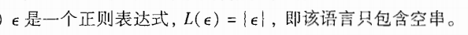
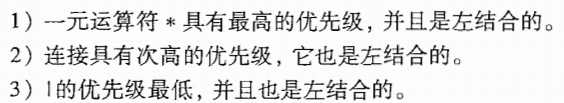

# 编译原理期末复习_bookv1_

## 第一章 introduction

### 1.1 语言处理器

一个编译器就是一个程序，它可以阅读某一种语言编写的程序。并把该程序翻译成为一个等价的，用另一种语言（目标语言）编写的程序。

如果目标程序是一个可执行的机器语言。那么它就可以被用户调用，处理并产生输出。

**解释器（interpreter）**是另一种常见的语言处理器。它并不通过翻译的方式产生目标程序。从用户的角度看，解释器直接利用用户提供的输入执行源程序中的指定操作

对比：在把用户输入映射成为输出的过程中，由一个编译器产生的机器语言目标程序通常比一个解释器**快很多**。然而**解释器的错误诊断效果**通常比编译器好，因为它逐个语句地执行源程序。

### 1.2 一个编译器的结构

> 如果看成黑盒子，它能够把源程序映射为语义上等价的目标程序。大致把这个映射过程分为两部分，即分析部分和综合部分。
>
> 分析analysis
>
> 综合synthesis
>
> 分析部分通常被称为编译器的前端front end，综合部分称为后端back end

#### 1.2.1 词法分析

词法分析lexical analysis也可称为扫描scanning。

读入：组层源程序的字符流

组成：有意义的**词素**序列

****

**词素**lexeme，对于每个词素，词法分析器产生如下的词法单元

词法分析输出可以作为前端部分的下一项，即语法分析的输入内容

#### 1.2.2 语法分析

编译器第2个步骤称为语法分析syntax analysis或者解析parsing。

作用：给出了词法分析产生的词法单元流的语法结构。

常用表示方法：语法树syntax tree。树种的点代表一个运算，而该店的子节点表示该运算的分量。

#### 1.2.3 语义分析

使用语法树和符号表中的信息来检查源程序是否和语言定义的语义一致。它同时也收集类型信息，并把这些信息存放在语法树或符号表中，以便随后的中间代码生成过程中使用

**类型检查type checking**: 编译器检查每个运算符时候具有匹配的运算分量。比如数组的下标必须是整数。如果此时采用浮点数作为数组下标，编译器就必须报告错误。

#### 1.2.4 中间代码生成

把一个源程序翻译成目标代码的过程中，一个编译器可能构造出一个或多个中间表示。这些中间表示可以有多重形式，语法树是一种中间表示形式，它们通常在语法分析和语义分析中使用。

很多源程序的语法分析和语义分析完成后，会产生一个类机器语言的中间表示（某个抽象机器的程序）。应该具有两个重要性质：

- 易于生成
- 能够被轻易地翻译为目标机器上的语言

#### 1.2.5 代码优化

机器无关的代码优化步骤试图改进中间代码，以便生成更好的目标代码。

注意，这个更好可以意味着很多不同的目的，比如更快的生成，或者生成更短，能耗更低的目标代码。

#### 1.2.6 代码生成

代码生成器以源程序的**中间表示**作为输入，把它映射到目标语言。如果目标语言是机器代码，那么它就必须为程序使用的每个变量选择寄存器或内存位置。

代码生成的一个直观重要的方面是合理分配寄存器以存放变量的值

#### 1.2.7 符号表管理

记录源程序中使用的变量的名字，并收集和每个名字的各种属性有关的信息。这些属性可以提供一个名字的存储分配、它的类型、作用域等信息。

对于**过程名字**这些信息还包括：它的参数数量和类型、每个参数的传递方法（比如传值或传引用）以及返回类型。

符号表数据结构为每个变量名字创建了一个记录条目。记录的字段也就是各个名字的各个属性。这个数据结构应该允许编译器循序查找到每个名字的记录，并向记录中快速存放和获取记录中的数据。

#### 1.2.8 将多个步骤组合成趟

在一个特定的实现中，多个步骤的活动可以被组合成一趟。每趟读入一个输入文件并产生一个输出文件。

分出了pass的概念，我们可以把不同的前端和某个目标机的后端结合起来，为不同的源语言简历该目标机上的编译器

#### 1.2.8 编译器的构造工具

- 语法分析器的生成器：根据一个程序设计语言的语法描述自动生成语法分析器
- 扫描器生成器：根据一个语言的语法单元的正则表达式描述生成词法分析器
- 语法制导翻译引擎：可以生成一组用于遍历分析树并生成中间代码的例程。
- 代码生成器的生成器：依据一组关于如何把中间语言的每个运算翻译成为目标机上的机器语言的规则，生成一个代码代码生成器。
- 数据流分析引擎：可以帮助收集数据流信息，即程序中的值如何从程序的一个部分传递到另一个部分。数据流分析是代码优化的一个重要部分。
- 编译器构造工具集

## 第二章 A Simple Syntax-Directed Translator

### 2.7 符号表 symbol table

> 是一种供编译器用于保存有关源程序构造的各种信息的数据结构。这些信息在编译器的分析阶段被逐步收集并放入符号表，他们在综合阶段用于生成目标代码。符号表的每个条目中包含一个与标识符相关的信息
>
> 符号表通常需要支持统一标识符在一个程序中的多重声明。（不同位置不同作用域但是符号表示是一样的）

#### 2.7.2 符号表的使用

## 第三章 词法分析

#### 3.1 词法分析器的作用

任务：读入源程序的输入字符、将他们组成词素，生成并输出一个词法单元序列，每个词法单元对应于一个词素。

得到的词法单元被输出到语法分析器中进行语法分析

词法分析器可以分为两个级联的处理阶段：扫描阶段、词法分析阶段

#### 3.1.1 词法分析及语法分析

首先明确编译过程的前端分析部分分解成词法分析和语法分析两个阶段的原因有：

- 最重要的考虑是简化编译器的设计。
- 提高编译器的效率。（将词法分析器独立出来可以使用更专注于词法分析任务、不进行语法分析技术。
- 增强编译器的可以执行。输入设备相关的特殊性可以被限制在词法分析器中。

#### 3.1.2 词法单元、模式和词素

##### 几个术语

- 词法单元：一个词法单元名和一个可选的属性值组成。
- 模式：描述了一个词法单元可能具有的形式。（即表明了这个的含义，正则表达，含有什么字符的那种感觉）
- 词素：源程序中的一个字符序列，它和某个词法单元的模式匹配，并被词法分析器识别为该词法单元的一个实例。

##### 通常的分类

- 每个关键字有一个词法单元
- 表示运算符的词法单元
- 一个表示所有标识符的词法单元
- 一个或多个表示常量的词法单元
- 每个标点符号有一个词法单元

####  3.1.3 词法单元的属性

如果有多个词素可以和一个模式匹配，那么词法分析器必须向编译器的后续阶段提供有关被匹配词素的附加信息（比如是类型，第一次出现的位置，他们或都保存在符号表中）。一个标识符的属性是一个指向符号表中该标识符对应条目的指针。

#### 3.1.4 词法错误

没有其他组件的帮助，单一的词法分析器很难发现源代码中的错误。

假设所有词法单元的模式都无法和剩余输入的某个前缀匹配的情况，此时词法分析器就不能继续处理输入。 通常最简单的错误恢复策略就是“恐慌模式”恢复。**即从剩余的输入中不断删除字符，直到词法分析器能够在剩余输入的开头发现一个正确的词法单元为止**。

### 3.3 词法单元的规约

正则表达式是一种用来描述词素模式的重要表示方法。

#### 3.3.1 串和语言

某个字母表上的一个串string是该字母表中符号的一个有穷序列。

语言language是某个给定字母表上一个任意的可数的串集合

#### 3.3.2 语言上的运算

最重要运算是并、连接和闭包运算。

#### 3.3.3 正则表达式

**归纳基础：**

- 
- 

**归纳步骤：**假设r和s都是正则表达式，分别表示语言L(r)和L(s)

- 
- 
- 
- 

可以采用如下的约定，可以丢掉一些括号：

可以用一个正则表达式定义的语言叫做正则集合（regular set）。如果两个正则表达式r和s表示相同的语言，则称r和s等价，记作r=s。正则表达式它满足一些代数定律。

