# 网络编程 week3

## 一个例子代码

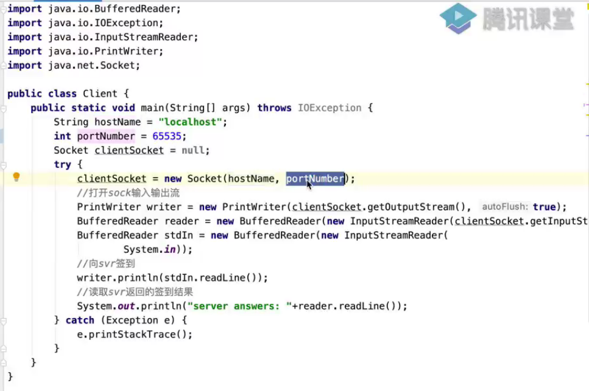

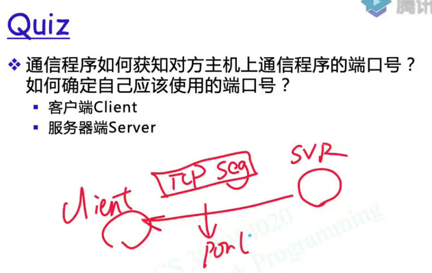

服务器是怎么设置自己的端口号和远端的端口号？

client是系统调用进入内核，内核随机分配一个端口号得到的。

server和这个不一样，如果server的local port是随机的话，则其与之前已经连接过的端口会发生矛盾。所以server的本地端口号是写死的，需要在代码中选定

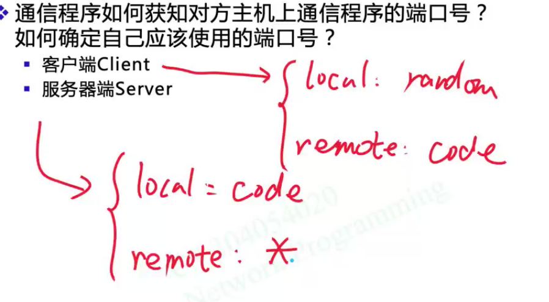

****

## TCP 三路握手

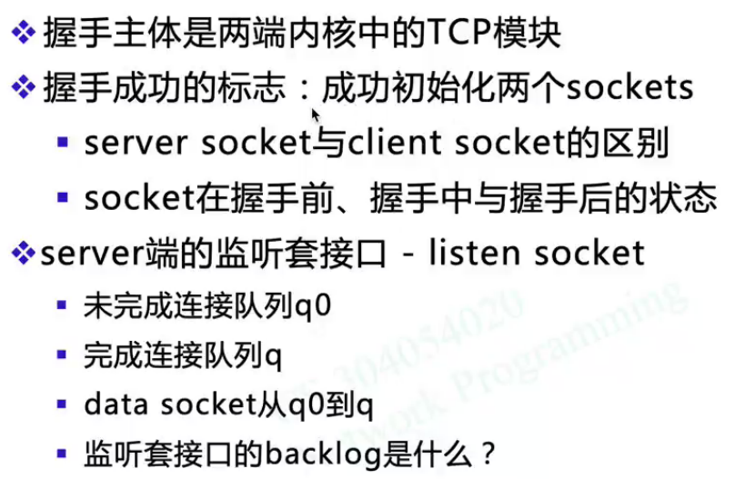

二者均成功初始化好了各自的socket

****

### 一个client为例

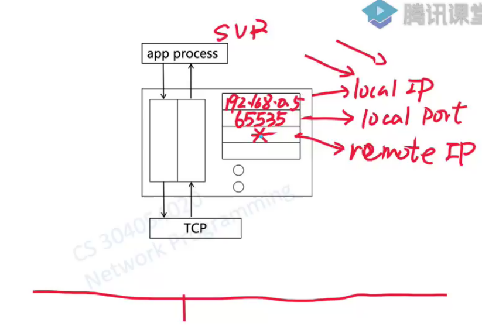

注意remote Ip，四元组中的远端ip地址填写为通配符

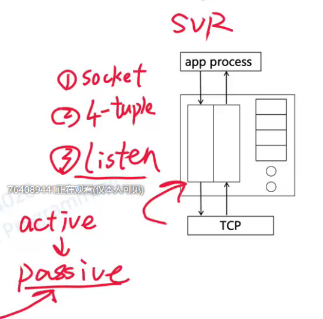

被动状态可以主动接受SYN，而主动状态是可以主动发送SYN

listen 可以把svr的状态由主动切换为被动。 只有套接口处于passive状态时，才能接受三路握手请求

****

## 客户端

1. 先创建好套接口

2. tcp在创建好套接口的同时，自动帮你初始化

3. 本地端口号是随机分配的

4. 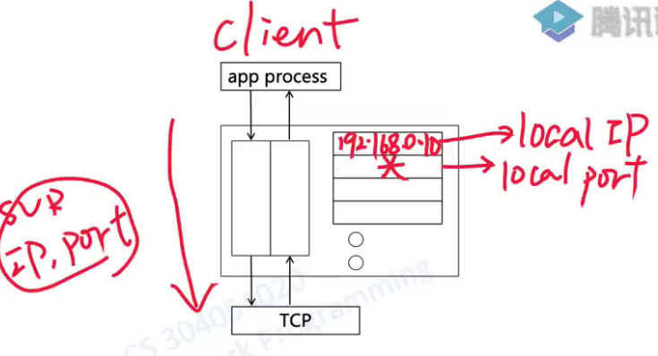

   注意不是*，实际上市某一个固定的端口，从0~65535 随机选一个。（不考虑well-known了吗）

   5. 服务器的ip和端口号都是提前系统调用送进来的写死的内容。

总结起来就是两步，初始化socket和初始化四元组

****

tcp包头里面s为1，是syn包

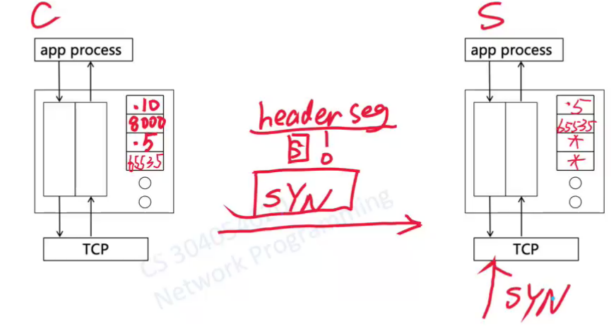

当svr的tcp收到了syn，1. 先去检查dst port目标端口号是什么

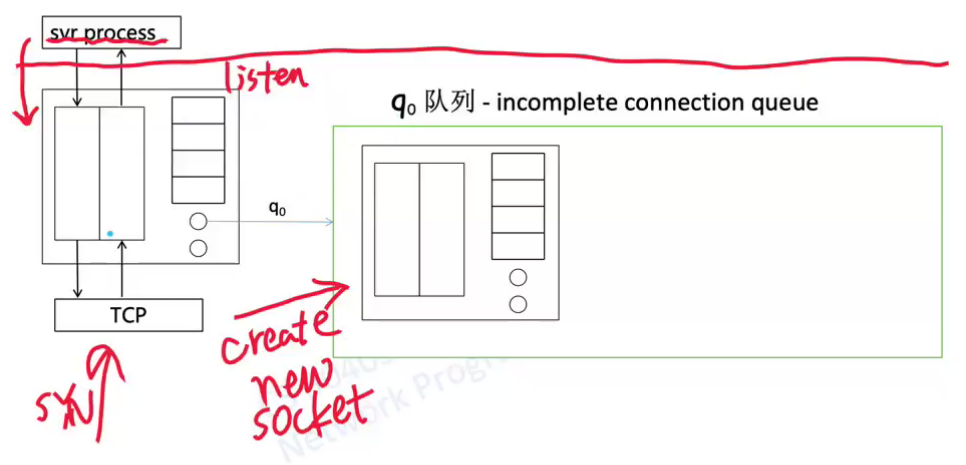

最左边是监听套接口，注意这个队列和server进程没有关系，它只是最初new socket来对请求进行监听。

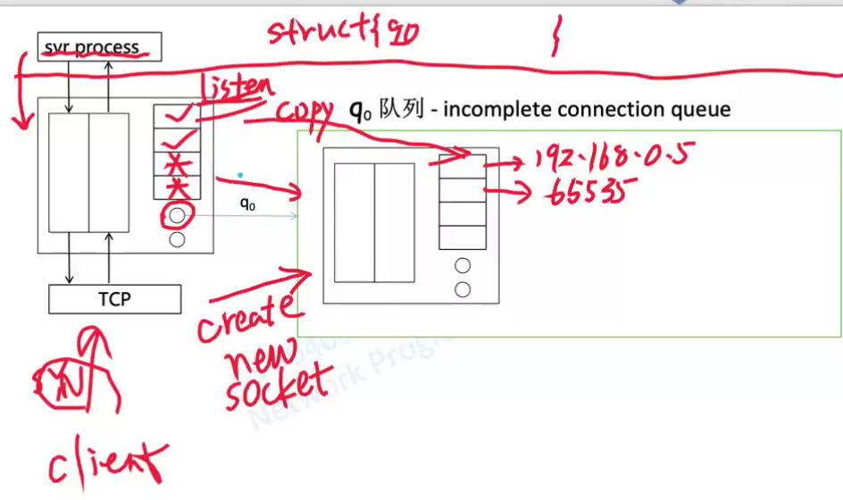

注意q0中的四元组信息，只copy客户端自己的两个信息，对于远端client的信息不需要copy通配符，而是直接拿走数据发送方的ip 和 8000

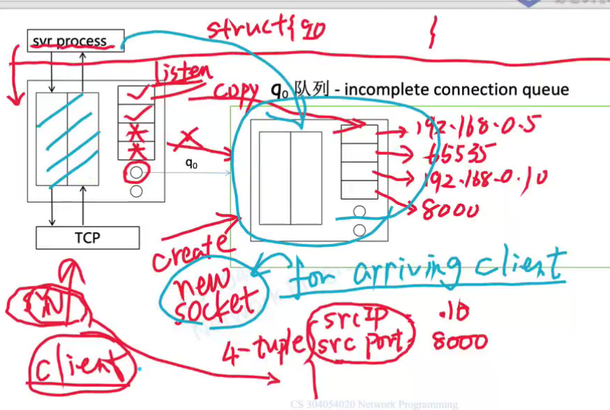

不用监听套接口的buffer，而是用队列里各个套接口自己的data buffer

注意q0队列的别名，-incomplete connection queue

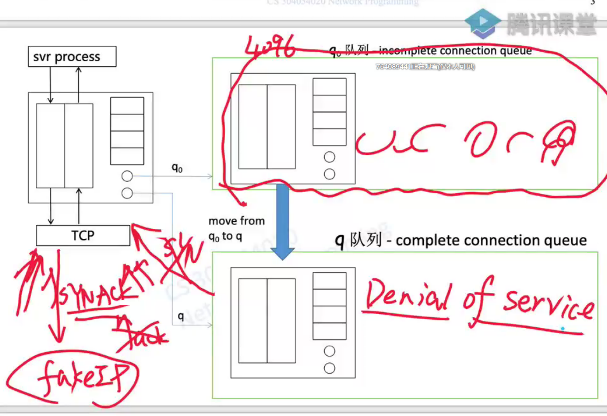

拒绝服务攻击，并不是让服务器坏，而是让队列填满。

