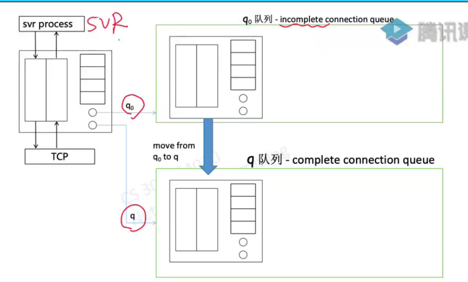
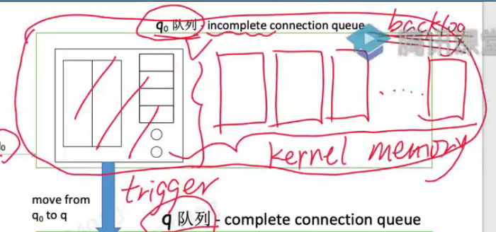
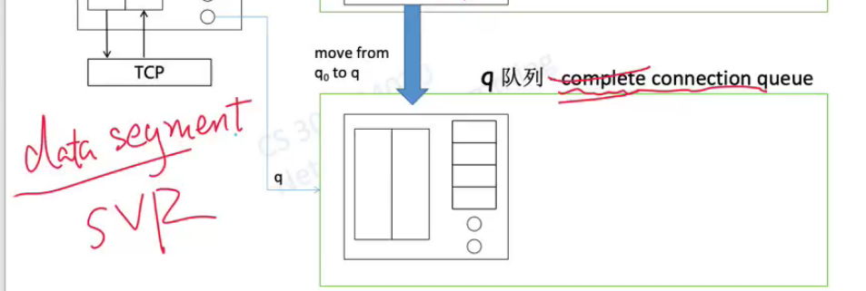
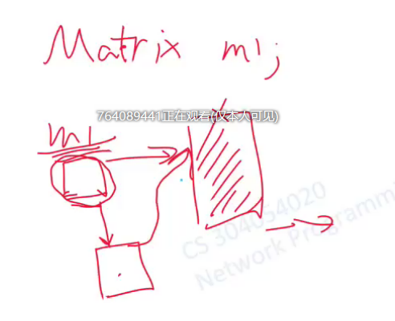
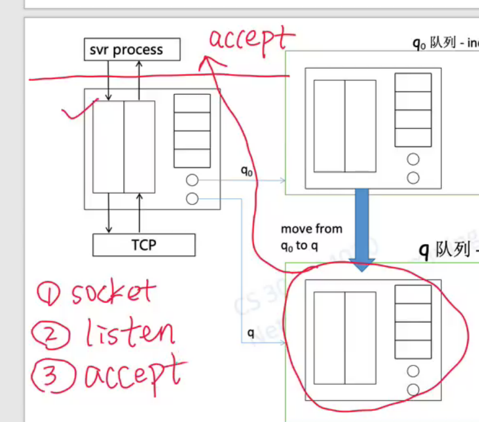
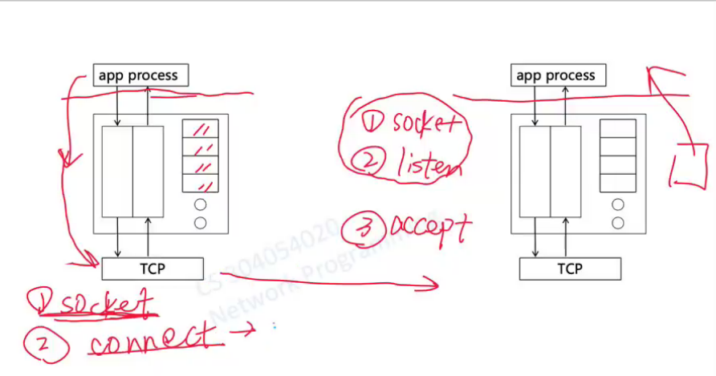
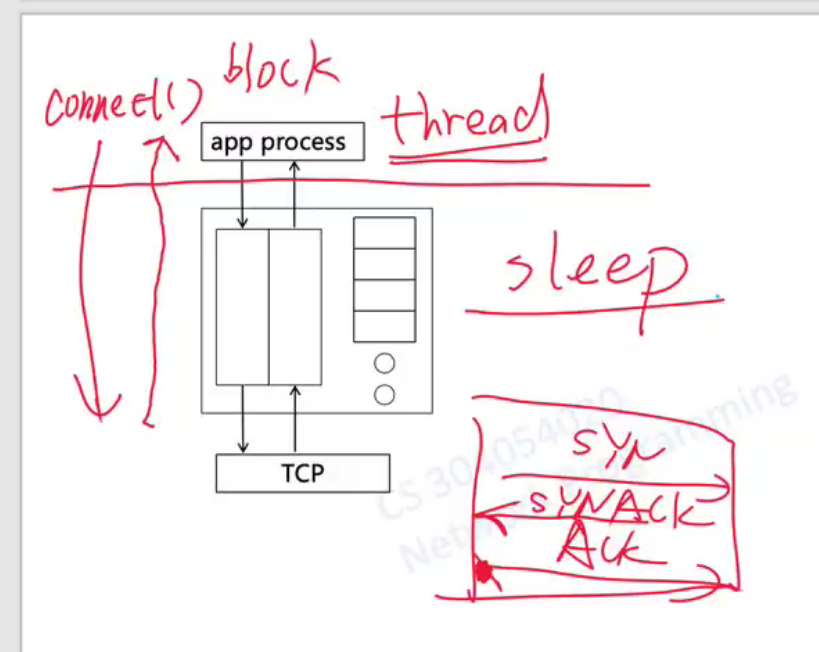
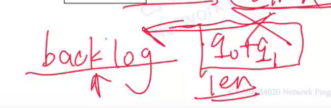
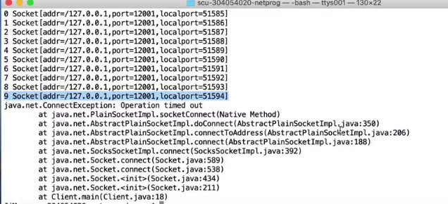

# week3 

> 搞定所有的socket基础知识

监听套接口面有两个很稳定的队列

q0和q队列只有在svr端才有用

收到握手请求之后，会为这个用户创建独立的套接口，放到q0中，接着svr返回syn信号，并且等待三路握手的最后一个ACK到达，然后才能把q0中的套接口放到q队列里

q0的长度设定，需要在listen之前或者当时就要对svr明确声明

为了避免高并发的情况，q0队列没有上限就会无限制增加套接口的数量，这个队列会特别长。而且这个东西会占据kernel memory

****

已经进入q队列的套接口，还不能进行正常的接收和发送数据

因为这个不是自己代码创建的，是TCP的一个动作的结果。其实际上是内核中被**tcp创建的，并不在应用层工作，应用程序该如何访问？**（server是在代码中创建的）

> java的函数，传递的参数值
>
> https://blog.csdn.net/mingli198611/article/details/7383534
>
> 所有的对象都是**引用对象**；把引用对象的内存空间中的信息copy到了新的参数的引用对象的内存空间中。 和传统的c语言的by value是不同的
>
> 
>
> 这个传入的引用，引用的是之前的引用的内存空间，并不是指向的是堆中的内存地址；这个对象本身很小，除了存储自己的信息，也传递了这个引用所对应的内存空间的信息

接下来就进行系统调用，在svr端返回已经同步的套接口，注意，不在保存在q队列中了，直接放在内核中，从此和监听套接口没有什么关系了

监听套接口发起这个accept动作，因为q队列本身就归属于监听套接口

****

client通过connect发送syn向svr进行握手操作

****

写代码的时候都要考虑到自己这一行代码会不会引起block发生

操作系统把这个线程看作sleep状态，因为其并不知道是一个延迟的IO操作

q满或者q0满，都会让server变为拒绝状态

## 作业

为什么

卡住了一会，就失败了，失败的原因是什么。

描述卡到那里开始到失败的时间区间中，客户端内核中tcp经历了什么事件。

### 答

第九个卡在那里是因为这个client在根据自己内核在三路握手的时间限制要求内等待服务器的ack响应信号，还处于挂起阶段，所以系统并没有报错，但是可以从上述报错信息中发现“java.net.ConnectException: Operation timed out" 这是一个超时错误。客户端中的套接字并有实现完整的建立流程，中途因为没有服务器的响应而终止了，直接原因是没有受到三路握手中传回的ack，根本原因是svr端没有accept操作，导致q0+q1队列中暂存的套接字数目达到上限而无法接收新的套接字。

tcp还在试图为匹配client三路握手的信号而在q0队列中装入新的套接字，但实际上因为达到上限而无法实现；

client进程与tcp交互暂停，处于挂起状态

因为时间达到了其内核本身设置的时限要求，为了保持性能必须断开连接