# week5 网络编程

## 作业讲解

之前backlock的值设置为10，q0和q队列总长度就被锁死为10；

客户端循环发起100次，前10个syn发起构成的节点填满队列之后，就没法收到server新的反馈响应了。

****

继续了什么动作？首先明确，有动作进行；客户端还是一直在进行重发包动作，因为它第一个发起的动作一直没有反馈；客户端不断发送SYN，一直尝试固定的次数（这个次数本身是可以调整的）；

处于挂起的状态，和内核TCP没有交互，因为没有唤醒的必要，它没有什么需要处理的内容，（如果三路握手成功等操作才会唤醒这个进程进行接下来的操作）

我们还是用代码实现的，如果构造函数遇到异常，发起动作失败，java源代码就会抛出其预先设定好的异常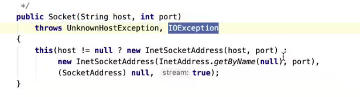

****

## 课堂讲解

### 三路握手异常分析

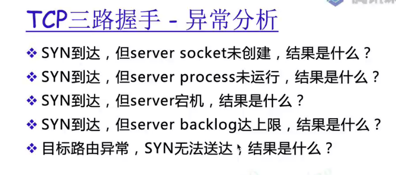

1 如果一new Socket马上失败，要关注其内容，一般是三路握手第一次就失败了，说明客户端的SYN一下子就到了SVR，且马上返回了用户态。只可能是远端svr马上恢复了数据包，但是不是期待的数据包而是RST这种网络复位包；很有可能是你SYN 包中携带的port出错，或者s**erver端就没有启动**

2 本质上和1没区别，tcp都找不到创建的套接口；都回发rst包

3 客户端的表现：类似于timeout，drop。

4 backlog 抵达上限之后，svr直接drop，不会有响应行为；（静悄悄）

5 情况1 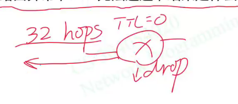

 情况2 一直达到重发次数的上限

情况3  若目标地址落在的是实验室地址或者内网地址，他们永远没法转发到公网上，所以你的这种数据包只可能在你的内网里边跑

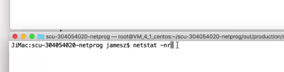

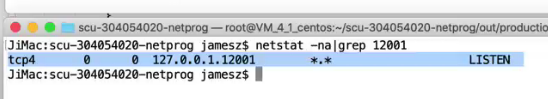

一般可以先观察监听套接口是否正常运转

****

快速的客户端和慢速的服务器端通信会怎么样？

会触发tcp的流量控制，双方无论是客户还是svr，二者都要把自己的接收缓冲区的大小告知对方（放在三路握手包中）

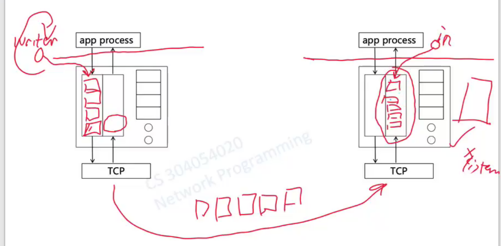

慢速的接收者不是网卡慢，而是其socket与svr进程中间的这个过程，这个取数据的频率较低造成的影响

****

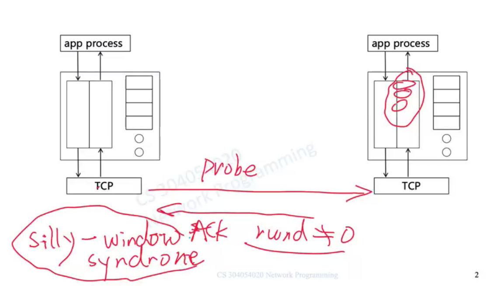

即使发送探测包得到了新数据，client也不一定会重新启动发送数据

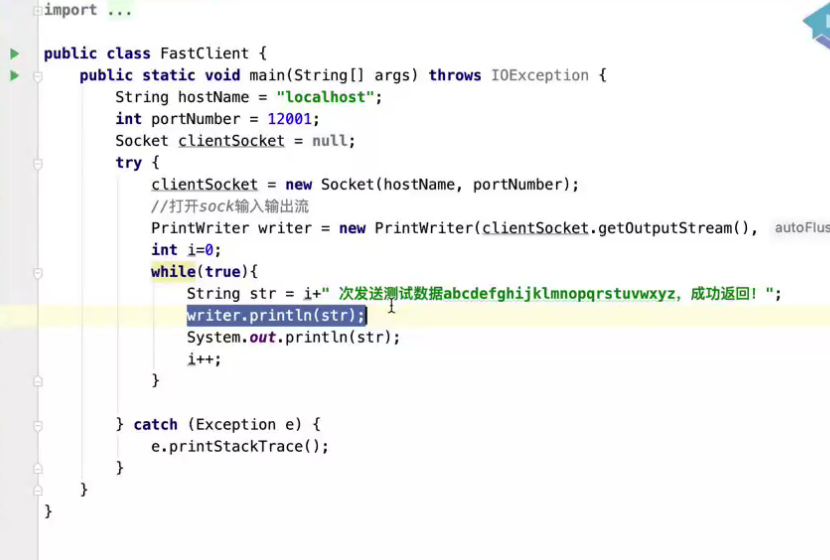

为什么这句话睡在内核里，套接口处于什么样状态？这句话才会挂起在内存中？

## 实验课

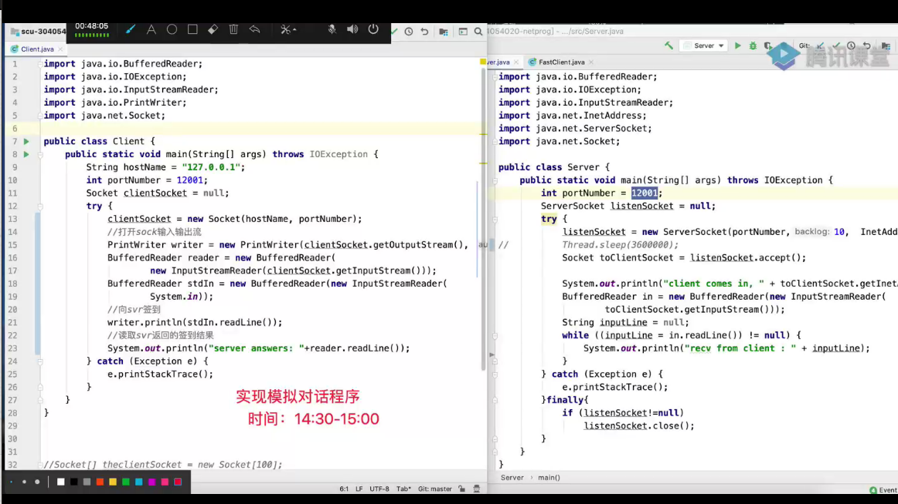

****

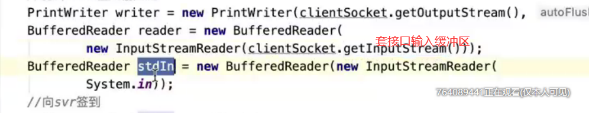

writer是输出缓冲区 发送数据的

reader是输入缓冲区，读取服务器返回的数据

stdIn 是java 键盘的标准输入

****

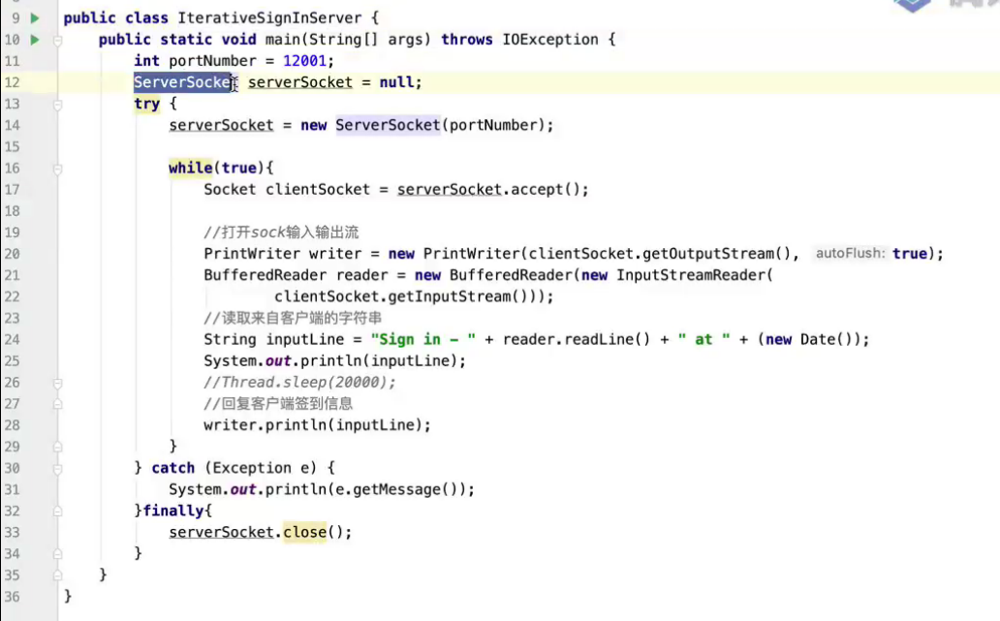

迭代服务器代码

 14 在内核中创建监听套接口 //socket + listen

17 把accept放在while循环内

****

任务：找出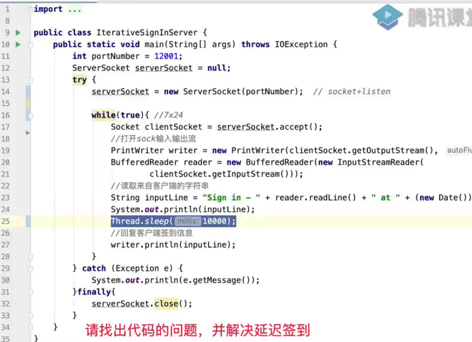

找出代码延迟的问题

“有同学问，提示下，处理结果的目标：实际签到时间以客户端敲回车的时间为准，，服务器必须准确记录该值”

