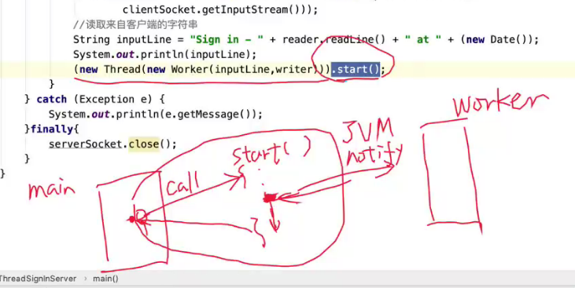

# week6 网络编程理论课 线程与并发

内容：网络编程中的并发

传统的迭代服务器就是循环服务器，可以理解为one loop的状态

解决问题的方案：

并发多线程之外的trick不具备伸缩性和可扩展性。

****

## 内容大纲

- **为什么要讨论并发技术**
- **常见的并发技术**
  - 线程
  - 锁、互斥、同步
- 并发和网络编程架构
  - reactor模式
  - 阻塞+多线程
  - 非阻塞+异步

> 多线程的并发程序调试的难度是比较高的，写的情况可能像薛定谔的猫，每次的结果对错是不确定的

****

## 为什么讨论并发

- 网络编程几乎无法避开并发

  - 远程I/O的idle本质

    > 所有的io设备都有可能产生延迟
    >
    > 我们一般提到优化，都是尽可能的减少idle，而不是无止境的提高带宽。

  - server端的并发服务

    > concurrent 只是模拟
    >
    > 如果只有一个core，多线程还是否有意义呢？即使在只有1个核的情况下，采用并发技术也可以改善性能：在系统中存在很多的idle
    >
    > 线程到底是在用户层还是在kernel层，实际情况是不同的

- 并发程序

  - 易出错
  - 难调试
  - 未充分**理解并发技术**导致的设计问题

## 常见的并发技术

### Thread 线程

> 

#### 首先要区分好**线程**和**进程**

写并发不一定是要多线程，例如谷歌浏览器就是创建多进程

- 当一个程序开始运行了，程序就会被加载到内存中运行，且以process的形式来进行；但是实际执行任务的代码和code直接相关的是线程（进程本身什么都不执行，执行的代码都不是进程本身执行，说白了是在内存中启动了一个container容器，可以把**进程理解为就是一个容器**。即进程是用来管理线程的容器，且会马上创建第一个线程，其也被称为**主线程**。

- 我们又要保证程序在cpu上运行，要找一个空闲的cpu core，把当前正在执行的线程挂在该可用cpu上。

  

  ****

  如果该线程代码中某一段存在计算密集型的代码，会导致该线程卡在这里，**但是不影响接下来代码的执行，与当前计算无关**。

  

  扔过去task之后，一个进程开了两个线程，实现了并发执行。

  ****

每个进程还有自己的地址空间address  space

注意到提供的是共享的是地址空间： 堆空间 所有的线程都可以共享

保存参数，和局部变量。我们在描述堆栈，都是**实际上讨论当前线程堆栈**

#### 线程是什么？

进程里边的一个代码执行的一条路径

code execution path; 

注意到我们的程序总是从主函数开始执行。主线程**总是去找这个主函数**，

线程是主函数第一行入口进入后就执行；即路径从主函数开始，从上到下执行完毕return就退出。线程结束，进程结束。

这些嵌套调用，最后返回到入口函数，到入口函数执行完，这整个箭头的前进过程就是一个代码执行路径，也对应着Thread。

如果是多线程，就以为着程序中存在多个这样的路径。

- entry function 入口函数

要十分强调，谁是这个进程的入口函数。

碰到入口函数，在进程容器中就创建一个新的线程，且直接从这个入口函数内的第一行开始运行，同时挂起在另一个空闲核心上

如果你不通过操作系统的一些指令集特殊指定，一个线程挂在什么核心上，会由操作系统的scheduler为你调度。

为了防止一个线程过久占用cpu，操作系统会使其放权，取下一个线程。

可以简单理解为“函数调函数”

#### 内核中的thread对象

为这个线程还会创建一个内核对象 kernel obj

一方面process中创建线程**（代码执行路径）**，二方面在内核中创建对象。这个**内核对象并不是线程本身**，是用来记录当前它所对应的线程的**信息**。

kernel obj中和NP有关的内容有：

- context 上下文

它是一个c语言的结构体。

**它记录了当前线程最后执行的那一刻，CPU中各个寄存器的状态值**

#### 上下文切换

例如windows，每20ms会扫描内核中所有的线程的内核对象。

有一个术语： schedulable。 我们把排在队中的内核对象，根据调度算法选出几个对象。然后把这个对象的内核对象中的上下文变量

准备把上下文信息拷贝进当前的CPU中（替换），注意，**替换之前**要将当前CPU寄存器中的值要回写到这个CPU中正在执行的线程对应的上下文变量中。

上下文切换是存在开销问题的，这个（CPU寄存器-内存）写入和拷贝的动作时耗费时间的。

****

将可能会引发当前线程idle的IO操作放在主线程中最合适。

大部分能引起阻塞的操作，尽量不要放在主线程中。因为实际工程中主线程中往往需要对**消息队列（**message loop）进行维护

多线程编程中要注意，这个新建线程的start()方法是在何处调用的。start是在构造对象的时候，就把对象作为参数扔到Thread中，然后虚拟机开始寻找入口函数

本身是在主线程中执行的1. 通知虚拟机启动线程 2. 虚拟机还要知道入口函数是什么（即将要启动的新线程的入口函数是谁）

例如runnable的run方法

可以认为start没有任何行为，它找到入口，通知虚拟机创建线程之后，就会立刻返回主线程。

****

1. 解决，不能因为alice先敲回车，tom无法签到的问题
2. 如果延迟sleep操作没有放在run方法中，放到的时候构造函数的最后一行

3. 可以创建一个新的类，MyTrhead，去extends Thread，所以它的派生类也可以直接实现runnable方法，

   这两种方法有没有什么区别，各自的优缺点是什么

现在多线程可以并发处理多个用户了，可以尝试改一下客户端的代码，让客户端的代码改成多线程的形式，即一个客户端启动可以打开两个进程。可以试试同时向服务器写数据观察结果

t1,t2这两个独立线程，对于同时写入数据会不会有什么意想不到的结果