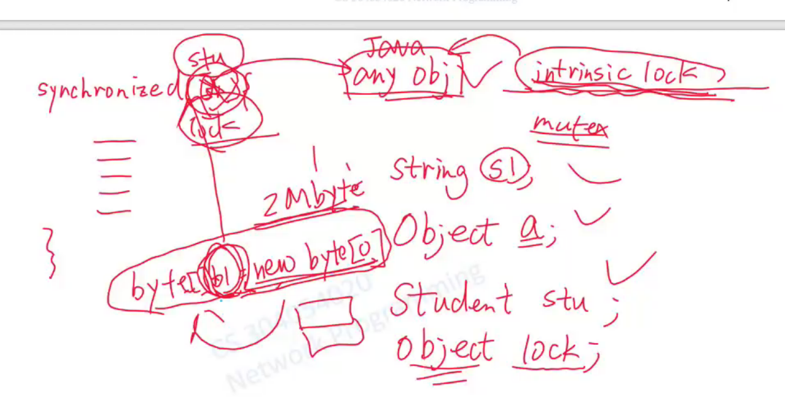

# week7 网络编程

> 继续和week6的内容呼应，继续衔接并发技术的内容
>
> 即继续讨论并发技术
>
> 
>
> 

****

把会引发IO操作的代码不要放到主线程中，把代码中的内容放到远程IO中。毕竟互联网中的内容一旦出现就会在路由器中排队。

所以也不能将引起IO操作的代码放到这些类的构造函数中。

向同一个套接口，应用层的消息是按照顺序依次写入的，（可以理解为java是线程安全的，注意套接口就是一个buffer，只能表示为，访问套接口的这些方法是线程安全的）

****

## 常见的并发技术

### 锁、互斥、同步

****

****

这个操作不是线程安全的，g=g+1;这个操作是分好几个步骤执行的，两个线程对内存空间操作的时候会发生冲突

****

run方法就是线程的一个入口函数，注意，你要扔到线程里面才能这样叫

注意，new出来之后要扔给线程，而线程的start函数的作用就是去寻找入口函数来创建线程

****

****

前者是逻辑分离的（业务逻辑并没有绑定在操作系统线程的这个元素上），后者是功能的单一的。

以一个案例来看线程之间的同步问题。

> 一个进程开的而两个线程同时向一个socket来写入缓冲区。

****

分析代码：两个writer的锁是否是同一个锁呢？ sychronized的作用失效，就会发生信息的交错。

****

文件本来在客户端，然后把东西保存到本地硬盘

1. 无论文件大小是多大都可以ok的transfer，保证没有字节损失

2. 可以不停的输出，当前输出的字节数占总字节数的百分比

> 如果能两个客户端一起传文件